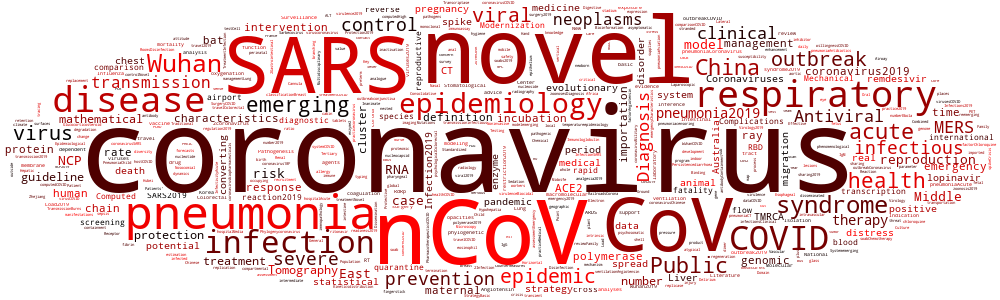

# Recent Coronavirus Paper Archive  코로나바이러스 연구 결과 모음 
  
Novel Coronavirus (also known as cov-2, nCoV, COVID-19) is sweeping over the world, also being a pressing issue in Korea. Reflecting the gravity of the serious illness, this repository will serve as a brief introduction to recent academic papers on the virus, possibly helping people more informed with what's been researched over the virus across the globe. This repository will be composed of a list of corona virus, organized by similarity and capitulated based on the significance of each paper. 

한국 내 코로나바이러스 (COVID-19)의 확진자 수가 지속적으로 증가함에 따라 본인을 포함한 많은 사람들의 불안이 상당하다 생각된다. 본 페이지에서는 COVID-19 바이러스의 최신 연구 논문을 최신 자료부터 차례로 공개하고, 시간이 허용하는 선에서 각 논문을 요약할 것이며, 동시에 본 작성자의 의견 또한 개진될 목적으로 운영될 계획이다. 바이러스가 잠잠해지길 기대함과 동시에 앞으로의 대한 두려움 또한 커지는 시기이다. 본 공간을 통해 작성자는 논문을 정리함으로써 바이러스에 대한 이해를 도모할 것이며, 이러한 과정에서 다른 시민들 또한 객관적인 자료들에 대한 접근성을 확보하고, 더불어 대처 과정에서 도움이 되기를 바라는 마음이다.     

 **Wordcloud** above has been generated based on gross keywords of all collected papers. 
 **위 그림**은 확보한 논문들의 키워드들을 바탕으로 제작되었음.

## To-do List 논문 업로드 및 정리 계획

* [ ] Upload newly published papers in a timely manner.  
      새로이 게재되는 논문의 실시간 반영
* [ ] Quick summary added for papers or groups of papers. 
      중요 논문 혹은 여러 논문에 대한 요약 및 그 시사성 정리
* [ ] Sort papers by date, nation and its nature. 
      날짜와 국가, 그리고 그 성격을 기준으로 한 논문의 정리
* [x] Paper list (past papers planned to be updated by 2/29/2020) 
      공개된 논문의 정리 (기존 논문은 2/29/2020까지 정리 예정)

## All Papers 전체 논문 리스트

- Paper search has been systematically done, mostly within [PubMed](https://www.ncbi.nlm.nih.gov/pubmed/), with the keywords, 'nCoV', 'cov-2', 'coronavirus' or 'COVID-19'.  
  아래 논문들은 대표적인 생물학 관련 논문 사이트인 [PubMed](https://www.ncbi.nlm.nih.gov/pubmed/)에서 'nCoV', 'cov-2', 'coronavirus' or 'COVID-19' 등의 키워드를 활용하여 수집되었음

|**Date  날짜**|**Author  저자**| **Title  제목**| **Journal 저널** |
|:---:|:---:|:---------------:|:---:|
| 2020-02-28|  Jernigan et al.|  [Update: Public Health Response to the Coronavirus Disease 2019 Outbreak - United States, February 24, 2020.](https://www.ncbi.nlm.nih.gov/pubmed/32106216)|  *MMWR. Morbidity and mortality weekly report*| 
| 2020-02-28|  Rasmussen et al.|  [Coronavirus Disease 2019 (COVID-19) and Pregnancy: What obstetricians need to know.](https://www.ncbi.nlm.nih.gov/pubmed/32105680)|  *American journal of obstetrics and gynecology*| 
| 2020-02-28|  Lee et al.|  [COVID-19 pneumonia: what has CT taught us?](https://www.ncbi.nlm.nih.gov/pubmed/32105641)|  *The Lancet. Infectious diseases*| 
| 2020-02-28|  Shi et al.|  [Radiological findings from 81 patients with COVID-19 pneumonia in Wuhan, China: a descriptive study.](https://www.ncbi.nlm.nih.gov/pubmed/32105637)|  *The Lancet. Infectious diseases*| 
| 2020-02-28|  Cheung et al.|  [Staff safety during emergency airway management for COVID-19 in Hong Kong.](https://www.ncbi.nlm.nih.gov/pubmed/32105633)|  *The Lancet. Respiratory medicine*| 
| 2020-02-28|  Zeng et al.|  [Chinese medical staff request international medical assistance in fighting against COVID-19.](https://www.ncbi.nlm.nih.gov/pubmed/32105614)|  *The Lancet. Global health*| 
| 2020-02-28|  Chen et al.|  [COVID-19 control in China during mass population movements at New Year.](https://www.ncbi.nlm.nih.gov/pubmed/32105609)|  *Lancet (London, England)*| 
| 2020-02-28|  Kanne et al.|  [Essentials for Radiologists on COVID-19: An Update-](https://www.ncbi.nlm.nih.gov/pubmed/32105562)|  *Radiology*| 
| 2020-02-28|  Imai et al.|  [Trust is a key factor in the willingness of health professionals to work during the COVID-19 outbreak: Experience from the H1N1 pandemic in Japan 2009.](https://www.ncbi.nlm.nih.gov/pubmed/32105381)|  *Psychiatry and clinical neurosciences*| 
| 2020-02-28|  Lan et al.|  [Positive RT-PCR Test Results in Patients Recovered From COVID-19.](https://www.ncbi.nlm.nih.gov/pubmed/32105304)|  *JAMA*| 
| 2020-02-28|  Prompetchara et al.|  [Immune responses in COVID-19 and potential vaccines: Lessons learned from SARS and MERS epidemic.](https://www.ncbi.nlm.nih.gov/pubmed/32105090)|  *Asian Pacific journal of allergy and immunology*| 
| 2020-02-28|  Li et al.|  [[Surgical treatment for esophageal cancer during the outbreak of COVID-19].](https://www.ncbi.nlm.nih.gov/pubmed/32105052)|  *Zhonghua zhong liu za zhi [Chinese journal of oncology]*| 
| 2020-02-28|  Giwa et al.|  [Novel coronavirus COVID-19: an overview for emergency clinicians](https://www.ncbi.nlm.nih.gov/pubmed/32105049)|  *Emergency medicine practice*| 
| 2020-02-28|  Li et al.|  [Development and Clinical Application of A Rapid IgM-IgG Combined Antibody Test for SARS-CoV-2 Infection Diagnosis.](https://www.ncbi.nlm.nih.gov/pubmed/32104917)|  *Journal of medical virology*| 
| 2020-02-28|  Li et al.|  [The neuroinvasive potential of SARS-CoV2 may be at least partially responsible for the respiratory failure of COVID-19 patients.](https://www.ncbi.nlm.nih.gov/pubmed/32104915)|  *Journal of medical virology*| 
| 2020-02-28|  Li et al.|  [Evolutionary history, potential intermediate animal host, and cross-species analyses of SARS-CoV-2.](https://www.ncbi.nlm.nih.gov/pubmed/32104911)|  *Journal of medical virology*| 
| 2020-02-28|  Park et al.|  [COVID-19: Lessons from SARS and MERS.](https://www.ncbi.nlm.nih.gov/pubmed/32104909)|  *European journal of immunology*| 
| 2020-02-28|  Yao et al.|  [A Systematic Review of Lopinavir Therapy for SARS Coronavirus and MERS Coronavirus-A Possible Reference for Coronavirus Disease-19 Treatment Option.](https://www.ncbi.nlm.nih.gov/pubmed/32104907)|  *Journal of medical virology*| 
| 2020-02-28|  Shrestha et al.|  [Nepal's First Case of COVID-19 and public health response.](https://www.ncbi.nlm.nih.gov/pubmed/32104884)|  *Journal of travel medicine*| 
| 2020-02-28|  None et al.|  [[Recommendation on the modernization of disease control and prevention].](https://www.ncbi.nlm.nih.gov/pubmed/32103652)|  *Zhonghua liu xing bing xue za zhi = Zhonghua liuxingbingxue zazhi*| 
| 2020-02-28|  Winichakoon et al.|  [Negative Nasopharyngeal and Oropharyngeal Swab Does Not Rule Out COVID-19.](https://www.ncbi.nlm.nih.gov/pubmed/32102856)|  *Journal of clinical microbiology*| 
| 2020-02-28|  Day et al.|  [Covid-19: Italy confirms 11 deaths as cases spread from north.](https://www.ncbi.nlm.nih.gov/pubmed/32102793)|  *BMJ (Clinical research ed.)*| 
| 2020-02-28|  Zuo et al.|  [Expert Recommendations for Tracheal Intubation in Critically ill Patients with Noval Coronavirus Disease 2019.](https://www.ncbi.nlm.nih.gov/pubmed/32102726)|  *Chinese medical sciences journal = Chung-kuo i hsueh k'o hsueh tsa chih*| 
| 2020-02-28|  Anzai et al.|  [Assessing the Impact of Reduced Travel on Exportation Dynamics of Novel Coronavirus Infection (COVID-19).](https://www.ncbi.nlm.nih.gov/pubmed/32102279)|  *Journal of clinical medicine*| 
| 2020-02-27|  Rubin et al.|  [Audio Interview: Preparing for the Spread of Covid-19.](https://www.ncbi.nlm.nih.gov/pubmed/32101683)|  *The New England journal of medicine*| 
| 2020-02-27|  Ai et al.|  [Correlation of Chest CT and RT-PCR Testing in Coronavirus Disease 2019 (COVID-19) in China: A Report of 1014 Cases.](https://www.ncbi.nlm.nih.gov/pubmed/32101510)|  *Radiology*| 
| 2020-02-27|  Liu et al.|  [[Health management of breast cancer patients outside the hospital during the outbreak of 2019 novel coronavirus disease].](https://www.ncbi.nlm.nih.gov/pubmed/32100979)|  *Zhonghua zhong liu za zhi [Chinese journal of oncology]*| 
| 2020-02-27|  Liu et al.|  [Composition and divergence of coronavirus spike proteins and host ACE2 receptors predict potential intermediate hosts of SARS-CoV-2.](https://www.ncbi.nlm.nih.gov/pubmed/32100877)|  *Journal of medical virology*| 
| 2020-02-27|  Haider et al.|  [Passengers' destinations from China: low risk of Novel Coronavirus (2019-nCoV) transmission into Africa and South America.](https://www.ncbi.nlm.nih.gov/pubmed/32100667)|  *Epidemiology and infection*| 
| 2020-02-27|  Huh et al.|  [Emergent Strategies for the Next Phase of COVID-19.](https://www.ncbi.nlm.nih.gov/pubmed/32100487)|  *Infection & chemotherapy*| 
| 2020-02-27|  Wei et al.|  [2019 Novel Coronavirus (COVID-19) Pneumonia: Serial Computed Tomography Findings.](https://www.ncbi.nlm.nih.gov/pubmed/32100486)|  *Korean journal of radiology*| 
| 2020-02-27|  Yoon et al.|  [Chest Radiographic and CT Findings of the 2019 Novel Coronavirus Disease (COVID-19): Analysis of Nine Patients Treated in Korea.](https://www.ncbi.nlm.nih.gov/pubmed/32100485)|  *Korean journal of radiology*| 
| 2020-02-27|  Tay et al.|  [De-isolating COVID-19 Suspect Cases: A Continuing Challenge.](https://www.ncbi.nlm.nih.gov/pubmed/32100024)|  *Clinical infectious diseases : an official publication of the Infectious Diseases Society of America*| 
| 2020-02-27|  Day et al.|  [Covid-19: surge in cases in Italy and South Korea makes pandemic look more likely.](https://www.ncbi.nlm.nih.gov/pubmed/32098875)|  *BMJ (Clinical research ed.)*| 
| 2020-02-27|  None et al.|  [COVID-19, Australia: Epidemiology Report 4 (Reporting week ending 19:00 AEDT 22 February 2020).](https://www.ncbi.nlm.nih.gov/pubmed/32098616)|  *Communicable diseases intelligence (2018)*| 
| 2020-02-27|  Xu et al.|  [Systematic Comparison of Two Animal-to-Human Transmitted Human Coronaviruses: SARS-CoV-2 and SARS-CoV.](https://www.ncbi.nlm.nih.gov/pubmed/32098422)|  *Viruses*| 
| 2020-02-27|  Roosa et al.|  [Short-term Forecasts of the COVID-19 Epidemic in Guangdong and Zhejiang, China: February 13-23, 2020.](https://www.ncbi.nlm.nih.gov/pubmed/32098289)|  *Journal of clinical medicine*| 
| 2020-02-27|  Kobayashi et al.|  [Communicating the Risk of Death from Novel Coronavirus Disease (COVID-19).](https://www.ncbi.nlm.nih.gov/pubmed/32098019)|  *Journal of clinical medicine*| 
| 2020-02-26|  Zhang et al.|  [Estimation of the reproductive number of Novel Coronavirus (COVID-19) and the probable outbreak size on the Diamond Princess cruise ship: A data-driven analysis.](https://www.ncbi.nlm.nih.gov/pubmed/32097725)|  *International journal of infectious diseases : IJID : official publication of the International Society for Infectious Diseases*| 
| 2020-02-26|  Harypursat et al.|  [Six weeks into the 2019 coronavirus disease (COVID-19) outbreak- it is time to consider strategies to impede the emergence of new zoonotic infections.](https://www.ncbi.nlm.nih.gov/pubmed/32097202)|  *Chinese medical journal*| 
| 2020-02-26|  Wen et al.|  [Anesthesia Procedure of Emergency Operation for Patients with Suspected or Confirmed COVID-19.](https://www.ncbi.nlm.nih.gov/pubmed/32096692)|  *Surgical infections*| 
| 2020-02-26|  Gao et al.|  [2019 novel coronavirus infection and gastrointestinal tract.](https://www.ncbi.nlm.nih.gov/pubmed/32096611)|  *Journal of digestive diseases*| 
| 2020-02-26|  Sun et al.|  [Understanding of COVID-19 based on current evidence.](https://www.ncbi.nlm.nih.gov/pubmed/32096567)|  *Journal of medical virology*| 
| 2020-02-26|  Wang et al.|  [Combination of RT-qPCR Testing and Clinical Features For Diagnosis of COVID-19 facilitates management of SARS-CoV-2 Outbreak.](https://www.ncbi.nlm.nih.gov/pubmed/32096564)|  *Journal of medical virology*| 
| 2020-02-26|  Zhao et al.|  [[The treatment proposal for the patients with breast diseases in the central epidemic area of 2019 coronavirus disease].](https://www.ncbi.nlm.nih.gov/pubmed/32096395)|  *Zhonghua wai ke za zhi [Chinese journal of surgery]*| 
| 2020-02-26|  Xu et al.|  [[Management of corona virus disease-19 (COVID-19): the Zhejiang experience].](https://www.ncbi.nlm.nih.gov/pubmed/32096367)|  *Zhejiang da xue xue bao. Yi xue ban = Journal of Zhejiang University. Medical sciences*| 
| 2020-02-26|  Wang et al.|  [[Dynamic changes of chest CT imaging in patients with corona virus disease-19 (COVID-19)].](https://www.ncbi.nlm.nih.gov/pubmed/32096366)|  *Zhejiang da xue xue bao. Yi xue ban = Journal of Zhejiang University. Medical sciences*| 
| 2020-02-26|  Trilla et al.|  [One world, one health: The novel coronavirus COVID-19 epidemic.](https://www.ncbi.nlm.nih.gov/pubmed/32093921)|  *Medicina clinica*| 
| 2020-02-26|  Xiao et al.|  [A Novel Approach of Consultation on 2019 Novel Coronavirus (COVID-19)-Related Psychological and Mental Problems: Structured Letter Therapy.](https://www.ncbi.nlm.nih.gov/pubmed/32093461)|  *Psychiatry investigation*| 
| 2020-02-26|  Deng et al.|  [Characteristics of and Public Health Responses to the Coronavirus Disease 2019 Outbreak in China.](https://www.ncbi.nlm.nih.gov/pubmed/32093211)|  *Journal of clinical medicine*| 
| 2020-02-26|  Boldog et al.|  [Risk Assessment of Novel Coronavirus COVID-19 Outbreaks Outside China.](https://www.ncbi.nlm.nih.gov/pubmed/32093043)|  *Journal of clinical medicine*| 
| 2020-02-26|  Goh et al.|  [Rigidity of the Outer Shell Predicted by a Protein Intrinsic Disorder Model Sheds Light on the COVID-19 (Wuhan-2019-nCoV) Infectivity.](https://www.ncbi.nlm.nih.gov/pubmed/32092911)|  *Biomolecules*| 
| 2020-02-25|  Song et al.|  [COVID-19: Real-time dissemination of scientific information to fight a public health emergency of international concern.](https://www.ncbi.nlm.nih.gov/pubmed/32092748)|  *Bioscience trends*| 
| 2020-02-25|  Tetro et al.|  [Is COVID-19 Receiving ADE From Other Coronaviruses?](https://www.ncbi.nlm.nih.gov/pubmed/32092539)|  *Microbes and infection*| 
| 2020-02-25|  Phan et al.|  [Genetic diversity and evolution of SARS-CoV-2.](https://www.ncbi.nlm.nih.gov/pubmed/32092483)|  *Infection, genetics and evolution : journal of molecular epidemiology and evolutionary genetics in infectious diseases*| 
| 2020-02-25|  Aw et al.|  [The non-contact handheld cutaneous infra-red thermometer for fever screening during the COVID-19 global emergency.](https://www.ncbi.nlm.nih.gov/pubmed/32092368)|  *The Journal of hospital infection*| 
| 2020-02-25|  Wu et al.|  [Characteristics of and Important Lessons From the Coronavirus Disease 2019 (COVID-19) Outbreak in China: Summary of a Report of 72 314 Cases From the Chinese Center for Disease Control and Prevention.](https://www.ncbi.nlm.nih.gov/pubmed/32091533)|  *JAMA*| 
| 2020-02-25|  Wu et al.|  [Chest CT Findings in Patients with Corona Virus Disease 2019 and its Relationship with Clinical Features.](https://www.ncbi.nlm.nih.gov/pubmed/32091414)|  *Investigative radiology*| 
| 2020-02-25|  Gostic et al.|  [Estimated effectiveness of symptom and risk screening to prevent the spread of COVID-19.](https://www.ncbi.nlm.nih.gov/pubmed/32091395)|  *eLife*| 
| 2020-02-25|  Tong et al.|  [Potential Presymptomatic Transmission of SARS-CoV-2, Zhejiang Province, China, 2020.](https://www.ncbi.nlm.nih.gov/pubmed/32091386)|  *Emerging infectious diseases*| 
| 2020-02-25|  Yang et al.|  [Facing the COVID-19 outbreak: What should we know and what could we do?](https://www.ncbi.nlm.nih.gov/pubmed/32091134)|  *Journal of medical virology*| 
| 2020-02-24|  Qin et al.|  |  *European journal of nuclear medicine and molecular imaging*| 
| 2020-02-24|  Jalava et al.|  [First respiratory transmitted food borne outbreak?](https://www.ncbi.nlm.nih.gov/pubmed/32088598)|  *International journal of hygiene and environmental health*| 
| 2020-02-24|  Ling et al.|  [COVID-19: a critical care perspective informed by lessons learnt from other viral epidemics.](https://www.ncbi.nlm.nih.gov/pubmed/32088344)|  *Anaesthesia, critical care & pain medicine*| 
| 2020-02-24|  Gilbert et al.|  [Preparedness and vulnerability of African countries against importations of COVID-19: a modelling study.](https://www.ncbi.nlm.nih.gov/pubmed/32087820)|  *Lancet (London, England)*| 
| 2020-02-24|  The Lancet et al.|  [COVID-19: fighting panic with information.](https://www.ncbi.nlm.nih.gov/pubmed/32087777)|  *Lancet (London, England)*| 
| 2020-02-23|  Zhang et al.|  [A novel coronavirus (COVID-19) outbreak: a call for action.](https://www.ncbi.nlm.nih.gov/pubmed/32087216)|  *Chest*| 
| 2020-02-23|  Calisher et al.|  [Statement in support of the scientists, public health professionals, and medical professionals of China combatting COVID-19.](https://www.ncbi.nlm.nih.gov/pubmed/32087122)|  *Lancet (London, England)*| 
| 2020-02-23|  Xu et al.|  [Open access epidemiological data from the COVID-19 outbreak.](https://www.ncbi.nlm.nih.gov/pubmed/32087115)|  *The Lancet. Infectious diseases*| 
| 2020-02-23|  Dong et al.|  [An interactive web-based dashboard to track COVID-19 in real time.](https://www.ncbi.nlm.nih.gov/pubmed/32087114)|  *The Lancet. Infectious diseases*| 
| 2020-02-23|  Peeri et al.|  [The SARS, MERS and novel coronavirus (COVID-19) epidemics, the newest and biggest global health threats: what lessons have we learned?](https://www.ncbi.nlm.nih.gov/pubmed/32086938)|  *International journal of epidemiology*| 
| 2020-02-23|  Li et al.|  [Novel Coronavirus disease 2019 (COVID-19): The importance of recognising possible early ocular manifestation and using protective eyewear.](https://www.ncbi.nlm.nih.gov/pubmed/32086236)|  *The British journal of ophthalmology*| 
| 2020-02-23|  Kmietowicz et al.|  [Rules on isolation rooms for suspected covid-19 cases in GP surgeries to be relaxed.](https://www.ncbi.nlm.nih.gov/pubmed/32086235)|  *BMJ (Clinical research ed.)*| 
| 2020-02-23|  Chen et al.|  [Initiation of a new infection control system for the COVID-19 outbreak.](https://www.ncbi.nlm.nih.gov/pubmed/32085850)|  *The Lancet. Infectious diseases*| 
| 2020-02-23|  Van Cuong et al.|  [The first Vietnamese case of COVID-19 acquired from China.](https://www.ncbi.nlm.nih.gov/pubmed/32085849)|  *The Lancet. Infectious diseases*| 
| 2020-02-23|  Xu et al.|  [Pathological findings of COVID-19 associated with acute respiratory distress syndrome.](https://www.ncbi.nlm.nih.gov/pubmed/32085846)|  *The Lancet. Respiratory medicine*| 
| 2020-02-23|  Yang et al.|  [Mental health services for older adults in China during the COVID-19 outbreak.](https://www.ncbi.nlm.nih.gov/pubmed/32085843)|  *The lancet. Psychiatry*| 
| 2020-02-23|  Liem et al.|  [The neglected health of international migrant workers in the COVID-19 epidemic.](https://www.ncbi.nlm.nih.gov/pubmed/32085842)|  *The lancet. Psychiatry*| 
| 2020-02-23|  Liu et al.|  [Online mental health services in China during the COVID-19 outbreak.](https://www.ncbi.nlm.nih.gov/pubmed/32085841)|  *The lancet. Psychiatry*| 
| 2020-02-23|  Duan et al.|  [Psychological interventions for people affected by the COVID-19 epidemic.](https://www.ncbi.nlm.nih.gov/pubmed/32085840)|  *The lancet. Psychiatry*| 
| 2020-02-23|  Chen et al.|  [Mental health care for medical staff in China during the COVID-19 outbreak.](https://www.ncbi.nlm.nih.gov/pubmed/32085839)|  *The lancet. Psychiatry*| 
| 2020-02-23|  Zu et al.|  [Coronavirus Disease 2019 (COVID-19): A Perspective from China.](https://www.ncbi.nlm.nih.gov/pubmed/32083985)|  *Radiology*| 
| 2020-02-23|  Catton et al.|  [Global challenges in health and health care for nurses and midwives everywhere.](https://www.ncbi.nlm.nih.gov/pubmed/32083728)|  *International nursing review*| 
| 2020-02-23|  Bai et al.|  [Presumed Asymptomatic Carrier Transmission of COVID-19.](https://www.ncbi.nlm.nih.gov/pubmed/32083643)|  *JAMA*| 
| 2020-02-23|  Lai et al.|  [Severe acute respiratory syndrome coronavirus 2 (SARS-CoV-2) and coronavirus disease-2019 (COVID-19): The epidemic and the challenges.](https://www.ncbi.nlm.nih.gov/pubmed/32081636)|  *International journal of antimicrobial agents*| 
| 2020-02-23|  Lim et al.|  [The Author's Response: Case of the Index Patient Who Caused Tertiary Transmission of Coronavirus Disease 2019 in Korea: the Application of Lopinavir/Ritonavir for the Treatment of COVID-19 Pneumonia Monitored by Quantitative RT-PCR.](https://www.ncbi.nlm.nih.gov/pubmed/32080993)|  *Journal of Korean medical science*| 
| 2020-02-23|  Kim et al.|  [Letter to the Editor: Case of the Index Patient Who Caused Tertiary Transmission of Coronavirus Disease 2019 in Korea: the Application of Lopinavir/Ritonavir for the Treatment of COVID-19 Pneumonia Monitored by Quantitative RT-PCR.](https://www.ncbi.nlm.nih.gov/pubmed/32080992)|  *Journal of Korean medical science*| 
| 2020-02-23|  Kim et al.|  [Viral Load Kinetics of SARS-CoV-2 Infection in First Two Patients in Korea.](https://www.ncbi.nlm.nih.gov/pubmed/32080991)|  *Journal of Korean medical science*| 
| 2020-02-23|  Linton et al.|  [Incubation Period and Other Epidemiological Characteristics of 2019 Novel Coronavirus Infections with Right Truncation: A Statistical Analysis of Publicly Available Case Data.](https://www.ncbi.nlm.nih.gov/pubmed/32079150)|  *Journal of clinical medicine*| 
| 2020-02-23|  Xiang et al.|  [Timely research papers about COVID-19 in China.](https://www.ncbi.nlm.nih.gov/pubmed/32078803)|  *Lancet (London, England)*| 
| 2020-02-23|  Murdoch et al.|  [COVID-19: another infectious disease emerging at the animal-human interface.](https://www.ncbi.nlm.nih.gov/pubmed/32078596)|  *The New Zealand medical journal*| 
| 2020-02-23|  Sabino-Silva et al.|  [Coronavirus COVID-19 impacts to dentistry and potential salivary diagnosis.](https://www.ncbi.nlm.nih.gov/pubmed/32078048)|  *Clinical oral investigations*| 
| 2020-02-23|  Binnicker et al.|  [Emergence of a Novel Coronavirus Disease (COVID-19) and the Importance of Diagnostic Testing: Why Partnership between Clinical Laboratories, Public Health Agencies, and Industry Is Essential to Control the Outbreak.](https://www.ncbi.nlm.nih.gov/pubmed/32077933)|  *Clinical chemistry*| 
| 2020-02-23|  Wong et al.|  [COVID-19 in Singapore-Current Experience: Critical Global Issues That Require Attention and Action.](https://www.ncbi.nlm.nih.gov/pubmed/32077901)|  *JAMA*| 
| 2020-02-23|  Bernheim et al.|  [Chest CT Findings in Coronavirus Disease-19 (COVID-19): Relationship to Duration of Infection.](https://www.ncbi.nlm.nih.gov/pubmed/32077789)|  *Radiology*| 
| 2020-02-23|  None et al.|  [[Expert consensus on preventing nosocomial transmission during respiratory care for critically ill patients infected by 2019 novel coronavirus pneumonia].](https://www.ncbi.nlm.nih.gov/pubmed/32077661)|  *Zhonghua jie he he hu xi za zhi = Zhonghua jiehe he huxi zazhi = Chinese journal of tuberculosis and respiratory diseases*| 
| 2020-02-23|  Liu et al.|  [[Preliminary study of the relationship between novel coronavirus pneumonia and liver function damage: a multicenter study].](https://www.ncbi.nlm.nih.gov/pubmed/32077660)|  *Zhonghua gan zang bing za zhi = Zhonghua ganzangbing zazhi = Chinese journal of hepatology*| 
| 2020-02-23|  Xu et al.|  [[Clinical Management of Lung Cancer Patients during the Outbreak of 2019 Novel Coronavirus Disease (COVID-19)].](https://www.ncbi.nlm.nih.gov/pubmed/32077441)|  *Zhongguo fei ai za zhi = Chinese journal of lung cancer*| 
| 2020-02-23|  Li et al.|  [[Preliminary Recommendations for Lung Surgery during 2019 Novel Coronavirus Disease (COVID-19) Epidemic Period].](https://www.ncbi.nlm.nih.gov/pubmed/32077440)|  *Zhongguo fei ai za zhi = Chinese journal of lung cancer*| 
| 2020-02-23|  Zhang et al.|  [Clinical characteristics of 140 patients infected with SARS-CoV-2 in Wuhan, China.](https://www.ncbi.nlm.nih.gov/pubmed/32077115)|  *Allergy*| 
| 2020-02-23|  Vetter et al.|  [Covid-19: a puzzle with many missing pieces.](https://www.ncbi.nlm.nih.gov/pubmed/32075791)|  *BMJ (Clinical research ed.)*| 
| 2020-02-23|  Mowbray et al.|  [Letter from China: covid-19 on the grapevine, on the internet, and in commerce.](https://www.ncbi.nlm.nih.gov/pubmed/32075783)|  *BMJ (Clinical research ed.)*| 
| 2020-02-23|  None et al.|  [[Expert consensus on chloroquine phosphate for the treatment of novel coronavirus pneumonia].](https://www.ncbi.nlm.nih.gov/pubmed/32075365)|  *Zhonghua jie he he hu xi za zhi = Zhonghua jiehe he huxi zazhi = Chinese journal of tuberculosis and respiratory diseases*| 
| 2020-02-23|  Jung et al.|  [Real-Time Estimation of the Risk of Death from Novel Coronavirus (COVID-19) Infection: Inference Using Exported Cases.](https://www.ncbi.nlm.nih.gov/pubmed/32075152)|  *Journal of clinical medicine*| 
| 2020-02-23|  Yu et al.|  [[Several suggestion of operation for colorectal cancer under the outbreak of Corona Virus Disease 19 in China].](https://www.ncbi.nlm.nih.gov/pubmed/32074719)|  *Zhonghua wei chang wai ke za zhi = Chinese journal of gastrointestinal surgery*| 
| 2020-02-20|  Gao et al.|  [Breakthrough: Chloroquine phosphate has shown apparent efficacy in treatment of COVID-19 associated pneumonia in clinical studies.](https://www.ncbi.nlm.nih.gov/pubmed/32074550)|  *Bioscience trends*| 
| 2020-02-20|  None et al.|  [COVID-19, Australia: Epidemiology Report 3 (Reporting week ending 19:00 AEDT 15 February 2020).](https://www.ncbi.nlm.nih.gov/pubmed/32074480)|  *Communicable diseases intelligence (2018)*| 
| 2020-02-20|  Lipsitch et al.|  [Defining the Epidemiology of Covid-19 - Studies Needed.](https://www.ncbi.nlm.nih.gov/pubmed/32074416)|  *The New England journal of medicine*| 
| 2020-02-20|  MacLaren et al.|  [Preparing for the Most Critically Ill Patients With COVID-19: The Potential Role of Extracorporeal Membrane Oxygenation.](https://www.ncbi.nlm.nih.gov/pubmed/32074258)|  *JAMA*| 
| 2020-02-20|  Fang et al.|  [Sensitivity of Chest CT for COVID-19: Comparison to RT-PCR.](https://www.ncbi.nlm.nih.gov/pubmed/32073353)|  *Radiology*| 
| 2020-02-20|  Han et al.|  [The course of clinical diagnosis and treatment of a case infected with coronavirus disease 2019.](https://www.ncbi.nlm.nih.gov/pubmed/32073161)|  *Journal of medical virology*| 
| 2020-02-20|  None et al.|  [[Cluster investigation Technical Guidelines for the 2019 Novel Coronavirus Pneumonia (COVID-19), China (1st Trial Version)].](https://www.ncbi.nlm.nih.gov/pubmed/32072794)|  *Zhonghua liu xing bing xue za zhi = Zhonghua liuxingbingxue zazhi*| 
| 2020-02-20|  Cheng et al.|  [2019 Novel coronavirus: where we are and what we know.](https://www.ncbi.nlm.nih.gov/pubmed/32072569)|  *Infection*| 
| 2020-02-20|  Kim et al.|  [Outbreak of novel coronavirus (COVID-19): What is the role of radiologists?](https://www.ncbi.nlm.nih.gov/pubmed/32072255)|  *European radiology*| 
| 2020-02-20|  Mahase et al.|  [Coronavirus covid-19 has killed more people than SARS and MERS combined, despite lower case fatality rate.](https://www.ncbi.nlm.nih.gov/pubmed/32071063)|  *BMJ (Clinical research ed.)*| 
| 2020-02-20|  Eurosurveillance Editorial Team et al.|  [Latest updates on COVID-19 from the European Centre for Disease Prevention and Control.](https://www.ncbi.nlm.nih.gov/pubmed/32070466)|  *Euro surveillance : bulletin Europeen sur les maladies transmissibles = European communicable disease bulletin*| 
| 2020-02-20|  Bernard Stoecklin et al.|  [First cases of coronavirus disease 2019 (COVID-19) in France: surveillance, investigations and control measures, January 2020.](https://www.ncbi.nlm.nih.gov/pubmed/32070465)|  *Euro surveillance : bulletin Europeen sur les maladies transmissibles = European communicable disease bulletin*| 
| 2020-02-19|  Gu et al.|  [Full spectrum of COVID-19 severity still being depicted - Authors' reply.](https://www.ncbi.nlm.nih.gov/pubmed/32066526)|  *Lancet (London, England)*| 
| 2020-02-19|  Xu et al.|  [Full spectrum of COVID-19 severity still being depicted.](https://www.ncbi.nlm.nih.gov/pubmed/32066525)|  *Lancet (London, England)*| 
| 2020-02-18|  Luo et al.|  [Can Chinese Medicine Be Used for Prevention of Corona Virus Disease 2019 (COVID-19)? A Review of Historical Classics, Research Evidence and Current Prevention Programs.](https://www.ncbi.nlm.nih.gov/pubmed/32065348)|  *Chinese journal of integrative medicine*| 
| 2020-02-18|  Bai et al.|  [[Analysis of the first cluster of cases in a family of novel coronavirus pneumonia in Gansu Province].](https://www.ncbi.nlm.nih.gov/pubmed/32064855)|  *Zhonghua yu fang yi xue za zhi [Chinese journal of preventive medicine]*| 
| 2020-02-18|  None et al.|  [[The epidemiological characteristics of an outbreak of 2019 novel coronavirus diseases (COVID-19) in China].](https://www.ncbi.nlm.nih.gov/pubmed/32064853)|  *Zhonghua liu xing bing xue za zhi = Zhonghua liuxingbingxue zazhi*| 
| 2020-02-18|  Wang et al.|  [Challenges to the system of reserve medical supplies for public health emergencies: reflections on the outbreak of the severe acute respiratory syndrome coronavirus 2 (SARS-CoV-2) epidemic in China.](https://www.ncbi.nlm.nih.gov/pubmed/32062645)|  *Bioscience trends*| 
| 2020-02-18|  Heymann et al.|  [COVID-19: what is next for public health?](https://www.ncbi.nlm.nih.gov/pubmed/32061313)|  *Lancet (London, England)*| 
| 2020-02-18|  Habibi et al.|  [Do not violate the International Health Regulations during the COVID-19 outbreak.](https://www.ncbi.nlm.nih.gov/pubmed/32061311)|  *Lancet (London, England)*| 
| 2020-02-18|  None et al.|  [[Cluster investigation Technical Guidelines for the 2019 Novel Coronavirus Pneumonia (COVID-19), China (1st Trial Version)].](https://www.ncbi.nlm.nih.gov/pubmed/32061201)|  *Zhonghua liu xing bing xue za zhi = Zhonghua liuxingbingxue zazhi*| 
| 2020-02-16|  Sun et al.|  [[Inhibitors of RAS Might Be a Good Choice for the Therapy of COVID-19 Pneumonia].](https://www.ncbi.nlm.nih.gov/pubmed/32061198)|  *Zhonghua jie he he hu xi za zhi = Zhonghua jiehe he huxi zazhi = Chinese journal of tuberculosis and respiratory diseases*| 
| 2020-02-15|  None et al.|  [[An update on the epidemiological characteristics of novel coronavirus pneumonia（COVID-19）].](https://www.ncbi.nlm.nih.gov/pubmed/32057211)|  *Zhonghua liu xing bing xue za zhi = Zhonghua liuxingbingxue zazhi*| 
| 2020-02-15|  Du et al.|  [[Pharmacotherapeutics for the New Coronavirus Pneumonia].](https://www.ncbi.nlm.nih.gov/pubmed/32057209)|  *Zhonghua jie he he hu xi za zhi = Zhonghua jiehe he huxi zazhi = Chinese journal of tuberculosis and respiratory diseases*| 
| 2020-02-15|  Lim et al.|  [Case of the Index Patient Who Caused Tertiary Transmission of COVID-19 Infection in Korea: the Application of Lopinavir/Ritonavir for the Treatment of COVID-19 Infected Pneumonia Monitored by Quantitative RT-PCR.](https://www.ncbi.nlm.nih.gov/pubmed/32056407)|  *Journal of Korean medical science*| 
| 2020-02-15|  Lin et al.|  [Novel Coronavirus Pneumonia Outbreak in 2019: Computed Tomographic Findings in Two Cases.](https://www.ncbi.nlm.nih.gov/pubmed/32056397)|  *Korean journal of radiology*| 
| 2020-02-14|  Du et al.|  [Risk for Transportation of 2019 Novel Coronavirus Disease from Wuhan to Other Cities in China.](https://www.ncbi.nlm.nih.gov/pubmed/32053479)|  *Emerging infectious diseases*| 
| 2020-02-14|  Pan et al.|  [Time Course of Lung Changes On Chest CT During Recovery From 2019 Novel Coronavirus (COVID-19) Pneumonia.](https://www.ncbi.nlm.nih.gov/pubmed/32053470)|  *Radiology*| 
| 2020-02-14|  Smith et al.|  [Straining the System: Novel Coronavirus (COVID-19) and Preparedness for Concomitant Disasters.](https://www.ncbi.nlm.nih.gov/pubmed/32053389)|  *American journal of public health*| 
| 2020-02-14|  Guarner et al.|  [Three Emerging Coronaviruses in Two Decades.](https://www.ncbi.nlm.nih.gov/pubmed/32053148)|  *American journal of clinical pathology*| 
| 2020-02-14|  Liu et al.|  [The reproductive number of COVID-19 is higher compared to SARS coronavirus.](https://www.ncbi.nlm.nih.gov/pubmed/32052846)|  *Journal of travel medicine*| 
| 2020-02-14|  Velavan et al.|  [The COVID-19 epidemic.](https://www.ncbi.nlm.nih.gov/pubmed/32052514)|  *Tropical medicine & international health : TM & IH*| 
| 2020-02-14|  Zhang et al.|  [Potential Interventions for Novel Coronavirus in China: A Systematic Review.](https://www.ncbi.nlm.nih.gov/pubmed/32052466)|  *Journal of medical virology*| 
| 2020-02-14|  Wax et al.|  [Practical recommendations for critical care and anesthesiology teams caring for novel coronavirus (2019-nCoV) patients.](https://www.ncbi.nlm.nih.gov/pubmed/32052373)|  *Canadian journal of anaesthesia = Journal canadien d'anesthesie*| 
| 2020-02-14|  Lum et al.|  [Outbreak of COVID-19 - an urgent need for good science to silence our fears?](https://www.ncbi.nlm.nih.gov/pubmed/32052064)|  *Singapore medical journal*| 
| 2020-02-13|  None et al.|  [COVID-19, Australia: Epidemiology Report 2 (Reporting week ending 19:00 AEDT 8 February 2020).](https://www.ncbi.nlm.nih.gov/pubmed/32050080)|  *Communicable diseases intelligence (2018)*| 
| 2020-02-06|  Habibzadeh et al.|  [The Novel Coronavirus: A Bird's Eye View.](https://www.ncbi.nlm.nih.gov/pubmed/32020915)|  *The international journal of occupational and environmental medicine*| 
| 2020-02-28|  Pan et al.|  [Viral load of SARS-CoV-2 in clinical samples.](https://www.ncbi.nlm.nih.gov/pubmed/32105638)|  *The Lancet. Infectious diseases*| 
| 2020-02-28|  Yang et al.|  [Clinical course and outcomes of critically ill patients with SARS-CoV-2 pneumonia in Wuhan, China: a single-centered, retrospective, observational study.](https://www.ncbi.nlm.nih.gov/pubmed/32105632)|  *The Lancet. Respiratory medicine*| 
| 2020-02-28|  Bouadma et al.|  [Severe SARS-CoV-2 infections: practical considerations and management strategy for intensivists.](https://www.ncbi.nlm.nih.gov/pubmed/32103284)|  *Intensive care medicine*| 
| 2020-02-28|  Liu et al.|  [No credible evidence supporting claims of the laboratory engineering of SARS-CoV-2.](https://www.ncbi.nlm.nih.gov/pubmed/32102621)|  *Emerging microbes & infections*| 
| 2020-02-27|  Xia et al.|  [Evaluation of coronavirus in tears and conjunctival secretions of patients with SARS-CoV-2 infection.](https://www.ncbi.nlm.nih.gov/pubmed/32100876)|  *Journal of medical virology*| 
| 2020-02-27|  Pan et al.|  [Challenges and countermeasures for organ donation during the SARS-CoV-2 epidemic: the experience of Sichuan Provincial People's Hospital.](https://www.ncbi.nlm.nih.gov/pubmed/32100062)|  *Intensive care medicine*| 
| 2020-02-26|  Lai et al.|  [Early Phylogenetic Estimate of the Effective Reproduction Number Of Sars-CoV-2.](https://www.ncbi.nlm.nih.gov/pubmed/32096566)|  *Journal of medical virology*| 
| 2020-02-26|  Letko et al.|  [Functional assessment of cell entry and receptor usage for SARS-CoV-2 and other lineage B betacoronaviruses.](https://www.ncbi.nlm.nih.gov/pubmed/32094589)|  *Nature microbiology*| 
| 2020-02-26|  Gordon et al.|  [The antiviral compound remdesivir potently inhibits RNA-dependent RNA polymerase from Middle East respiratory syndrome coronavirus.](https://www.ncbi.nlm.nih.gov/pubmed/32094225)|  *The Journal of biological chemistry*| 
| 2020-02-23|  Pan et al.|  [Asymptomatic cases in a family cluster with SARS-CoV-2 infection.](https://www.ncbi.nlm.nih.gov/pubmed/32087116)|  *The Lancet. Infectious diseases*| 
| 2020-02-23|  Yeo et al.|  [Enteric involvement of coronaviruses: is faecal-oral transmission of SARS-CoV-2 possible?](https://www.ncbi.nlm.nih.gov/pubmed/32087098)|  *The lancet. Gastroenterology & hepatology*| 
| 2020-02-23|  Park et al.|  [Virus Isolation from the First Patient with SARS-CoV-2 in Korea.](https://www.ncbi.nlm.nih.gov/pubmed/32080990)|  *Journal of Korean medical science*| 
| 2020-02-23|  Dilcher et al.|  [SARS-CoV-2: a novel deadly virus in a globalised world.](https://www.ncbi.nlm.nih.gov/pubmed/32078595)|  *The New Zealand medical journal*| 
| 2020-02-23|  Xu et al.|  [Clinical findings in a group of patients infected with the 2019 novel coronavirus (SARS-Cov-2) outside of Wuhan, China: retrospective case series.](https://www.ncbi.nlm.nih.gov/pubmed/32075786)|  *BMJ (Clinical research ed.)*| 
| 2020-02-20|  Zou et al.|  [SARS-CoV-2 Viral Load in Upper Respiratory Specimens of Infected Patients.](https://www.ncbi.nlm.nih.gov/pubmed/32074444)|  *The New England journal of medicine*| 
| 2020-02-20|  Nguyen et al.|  [Virus against virus: a potential treatment for 2019-nCov (SARS-CoV-2) and other RNA viruses.](https://www.ncbi.nlm.nih.gov/pubmed/32071427)|  *Cell research*| 
| 2020-02-20|  Colson et al.|  [Chloroquine for the 2019 novel coronavirus SARS-CoV-2.](https://www.ncbi.nlm.nih.gov/pubmed/32070753)|  *International journal of antimicrobial agents*| 
| 2020-02-19|  Hoehl et al.|  [Evidence of SARS-CoV-2 Infection in Returning Travelers from Wuhan, China.](https://www.ncbi.nlm.nih.gov/pubmed/32069388)|  *The New England journal of medicine*| 
| 2020-02-19|  Liang et al.|  [Cancer patients in SARS-CoV-2 infection: a nationwide analysis in China.](https://www.ncbi.nlm.nih.gov/pubmed/32066541)|  *The Lancet. Oncology*| 
| 2020-02-15|  Jiang et al.|  [Does SARS-CoV-2 has a longer incubation period than SARS and MERS?](https://www.ncbi.nlm.nih.gov/pubmed/32056235)|  *Journal of medical virology*| 
| 2020-02-13|  Liu et al.|  [A Locally Transmitted Case of SARS-CoV-2 Infection in Taiwan.](https://www.ncbi.nlm.nih.gov/pubmed/32050059)|  *The New England journal of medicine*| 
| 2020-02-13|  Lorusso et al.|  [Novel coronavirus (SARS-CoV-2) epidemic: a veterinary perspective.](https://www.ncbi.nlm.nih.gov/pubmed/32048818)|  *Veterinaria italiana*| 
| 2020-02-10|  Kampf et al.|  [Persistence of coronaviruses on inanimate surfaces and their inactivation with biocidal agents.](https://www.ncbi.nlm.nih.gov/pubmed/32035997)|  *The Journal of hospital infection*| 
| 2020-02-28|  Ghebreyesus et al.|  [Scientists are sprinting to outpace the novel coronavirus.](https://www.ncbi.nlm.nih.gov/pubmed/32105610)|  *Lancet (London, England)*| 
| 2020-02-28|  Azamfirei et al.|  [The 2019 Novel Coronavirus: A Crown Jewel of Pandemics?](https://www.ncbi.nlm.nih.gov/pubmed/32104726)|  *Journal of critical care medicine (Universitatea de Medicina si Farmacie din Targu-Mures)*| 
| 2020-02-28|  Liang et al.|  [Diarrhoea may be underestimated: a missing link in 2019 novel coronavirus.](https://www.ncbi.nlm.nih.gov/pubmed/32102928)|  *Gut*| 
| 2020-02-28|  Zhao et al.|  [The 2019 novel coronavirus resource.](https://www.ncbi.nlm.nih.gov/pubmed/32102777)|  *Yi chuan = Hereditas*| 
| 2020-02-28|  Chen et al.|  [Detectable 2019-nCoV viral RNA in blood is a strong indicator for the further clinical severity.](https://www.ncbi.nlm.nih.gov/pubmed/32102625)|  *Emerging microbes & infections*| 
| 2020-02-28|  Cai et al.|  [[First case of 2019 novel coronavirus infection in children in Shanghai].](https://www.ncbi.nlm.nih.gov/pubmed/32102141)|  *Zhonghua er ke za zhi = Chinese journal of pediatrics*| 
| 2020-02-28|  Fang et al.|  [[Facing the pandemic of 2019 novel coronavirus infections: the pediatric perspectives].](https://www.ncbi.nlm.nih.gov/pubmed/32102140)|  *Zhonghua er ke za zhi = Chinese journal of pediatrics*| 
| 2020-02-27|  Morens et al.|  [Escaping Pandora's Box - Another Novel Coronavirus.](https://www.ncbi.nlm.nih.gov/pubmed/32101660)|  *The New England journal of medicine*| 
| 2020-02-27|  Li et al.|  [[Chemotherapy strategy for colorectal cancer under the outbreak of novel coronavirus pneumonia].](https://www.ncbi.nlm.nih.gov/pubmed/32100980)|  *Zhonghua wei chang wai ke za zhi = Chinese journal of gastrointestinal surgery*| 
| 2020-02-27|  Cheng et al.|  [[Thoughts and suggestions on modern construction of disease prevention and control system].](https://www.ncbi.nlm.nih.gov/pubmed/32100978)|  *Zhonghua yu fang yi xue za zhi [Chinese journal of preventive medicine]*| 
| 2020-02-27|  Tang et al.|  [An updated estimation of the risk of transmission of the novel coronavirus (2019-nCov).](https://www.ncbi.nlm.nih.gov/pubmed/32099934)|  *Infectious Disease Modelling*| 
| 2020-02-27|  Shi et al.|  [[What are the highlights of "Diagnosis and treatment of Disease 2019 novel coronavirus infection suitable for Military support Hubei medical team"].](https://www.ncbi.nlm.nih.gov/pubmed/32098466)|  *Zhonghua jie he he hu xi za zhi = Zhonghua jiehe he huxi zazhi = Chinese journal of tuberculosis and respiratory diseases*| 
| 2020-02-27|  Shanmugaraj et al.|  [Emergence of Novel Coronavirus 2019-nCoV: Need for Rapid Vaccine and Biologics Development.](https://www.ncbi.nlm.nih.gov/pubmed/32098302)|  *Pathogens (Basel, Switzerland)*| 
| 2020-02-26|  Xia et al.|  [Non-invasive respiratory support for patients with novel coronavirus pneumonia: clinical efficacy and reduction in risk of infection transmission.](https://www.ncbi.nlm.nih.gov/pubmed/32097201)|  *Chinese medical journal*| 
| 2020-02-26|  Ma et al.|  [[Surgical treatment strategy for digestive system malignancies during the outbreak of novel coronavirus pneumonia].](https://www.ncbi.nlm.nih.gov/pubmed/32096396)|  *Zhonghua zhong liu za zhi [Chinese journal of oncology]*| 
| 2020-02-26|  Zhu et al.|  [The Risk and Prevention of Novel Coronavirus Pneumonia Infections Among Inpatients in Psychiatric Hospitals.](https://www.ncbi.nlm.nih.gov/pubmed/32096116)|  *Neuroscience bulletin*| 
| 2020-02-26|  Park et al.|  [Mental Health Care Measures in Response to the 2019 Novel Coronavirus Outbreak in Korea.](https://www.ncbi.nlm.nih.gov/pubmed/32093458)|  *Psychiatry investigation*| 
| 2020-02-25|  Li et al.|  [Analysis of angiotensin-converting enzyme 2 (ACE2) from different species sheds some light on cross-species receptor usage of a novel coronavirus 2019-nCoV.](https://www.ncbi.nlm.nih.gov/pubmed/32092392)|  *The Journal of infection*| 
| 2020-02-25|  Kwok et al.|  [Novel coronavirus (2019-nCoV) cases in Hong Kong and implications for further spread.](https://www.ncbi.nlm.nih.gov/pubmed/32092391)|  *The Journal of infection*| 
| 2020-02-25|  Hao et al.|  [Clinical Features of Atypical 2019 Novel Coronavirus Pneumonia with an initially Negative RT-PCR Assay.](https://www.ncbi.nlm.nih.gov/pubmed/32092387)|  *The Journal of infection*| 
| 2020-02-25|  Kooraki et al.|  [Coronavirus Outbreak: What the Department of Radiology Should Know.](https://www.ncbi.nlm.nih.gov/pubmed/32092296)|  *Journal of the American College of Radiology : JACR*| 
| 2020-02-25|  Jia et al.|  [[Strengthen comprehensive strategies to treat patients with mild novel coronavirus pneumonia].](https://www.ncbi.nlm.nih.gov/pubmed/32090534)|  *Zhonghua nei ke za zhi*| 
| 2020-02-25|  Patel et al.|  [Initial public health response and interim clinical guidance for the 2019 novel coronavirus outbreak - United States, December 31, 2019-February 4, 2020.](https://www.ncbi.nlm.nih.gov/pubmed/32090470)|  *American journal of transplantation : official journal of the American Society of Transplantation and the American Society of Transplant Surgeons*| 
| 2020-02-25|  Michaels et al.|  [Coronavirus Disease 2019: Implications of Emerging Infections for Transplantation.](https://www.ncbi.nlm.nih.gov/pubmed/32090448)|  *American journal of transplantation : official journal of the American Society of Transplantation and the American Society of Transplant Surgeons*| 
| 2020-02-25|  None et al.|  [[Consideration on the strategies during epidemic stage changing from emergency response to continuous prevention and control].](https://www.ncbi.nlm.nih.gov/pubmed/32088947)|  *Zhonghua liu xing bing xue za zhi = Zhonghua liuxingbingxue zazhi*| 
| 2020-02-24|  Ralph et al.|  [2019-nCoV (Wuhan virus), a novel Coronavirus: human-to-human transmission, travel-related cases, and vaccine readiness.](https://www.ncbi.nlm.nih.gov/pubmed/32088679)|  *Journal of infection in developing countries*| 
| 2020-02-24|  Kelvin et al.|  [Fear of the novel coronavirus.](https://www.ncbi.nlm.nih.gov/pubmed/32088678)|  *Journal of infection in developing countries*| 
| 2020-02-24|  Zhao et al.|  [The basic reproduction number of novel coronavirus (2019-nCoV) estimation based on exponential growth in the early outbreak in China from 2019 to 2020: A reply to Dhungana.](https://www.ncbi.nlm.nih.gov/pubmed/32088339)|  *International journal of infectious diseases : IJID : official publication of the International Society for Infectious Diseases*| 
| 2020-02-24|  Dhungana et al.|  [Comments on "Preliminary estimation of the basic reproduction number of novel Coronavirus (2019-nCoV) in China, from 2019 to 2020: A data-driven Analysis in the early phase of the outbreak".](https://www.ncbi.nlm.nih.gov/pubmed/32088335)|  *International journal of infectious diseases : IJID : official publication of the International Society for Infectious Diseases*| 
| 2020-02-24|  Li et al.|  [[Comparison of the clinical characteristics between RNA positive and negative patients clinically diagnosed with 2019 novel coronavirus pneumonia].](https://www.ncbi.nlm.nih.gov/pubmed/32087623)|  *Zhonghua jie he he hu xi za zhi = Zhonghua jiehe he huxi zazhi = Chinese journal of tuberculosis and respiratory diseases*| 
| 2020-02-24|  Qiu et al.|  [[The keypoints in treatment of the critical novel coronavirus pneumonia patient].](https://www.ncbi.nlm.nih.gov/pubmed/32087621)|  *Zhonghua jie he he hu xi za zhi = Zhonghua jiehe he huxi zazhi = Chinese journal of tuberculosis and respiratory diseases*| 
| 2020-02-23|  Li et al.|  [The epidemic of 2019-novel-coronavirus (2019-nCoV) pneumonia and insights for emerging infectious diseases in the future.](https://www.ncbi.nlm.nih.gov/pubmed/32087334)|  *Microbes and infection*| 
| 2020-02-23|  Hao et al.|  [First Atypical case of 2019 novel coronavirus in Yan'an, China.](https://www.ncbi.nlm.nih.gov/pubmed/32087323)|  *Clinical microbiology and infection : the official publication of the European Society of Clinical Microbiology and Infectious Diseases*| 
| 2020-02-23|  Qu et al.|  [[Psychological intervention in oral patients in novel coronavirus pneumonia outbreak period].](https://www.ncbi.nlm.nih.gov/pubmed/32086886)|  *Zhonghua kou qiang yi xue za zhi = Zhonghua kouqiang yixue zazhi = Chinese journal of stomatology*| 
| 2020-02-23|  Luo et al.|  [[Standardized diagnosis and treatment of colorectal cancer during the outbreak of novel coronavirus pneumonia in Renji hospital].](https://www.ncbi.nlm.nih.gov/pubmed/32084676)|  *Zhonghua wei chang wai ke za zhi = Chinese journal of gastrointestinal surgery*| 
| 2020-02-23|  Lippi et al.|  [The novel coronavirus (2019-nCoV) outbreak: think the unthinkable and be prepared to face the challenge.](https://www.ncbi.nlm.nih.gov/pubmed/32083831)|  *Diagnosis (Berlin, Germany)*| 
| 2020-02-23|  Hu et al.|  [[Risk assessment of exported risk of novel coronavirus pneumonia from Hubei Province].](https://www.ncbi.nlm.nih.gov/pubmed/32083409)|  *Zhonghua yu fang yi xue za zhi [Chinese journal of preventive medicine]*| 
| 2020-02-23|  Tang et al.|  [[Emergency management of prevention and control of novel coronavirus pneumonia in departments of stomatology].](https://www.ncbi.nlm.nih.gov/pubmed/32080994)|  *Zhonghua kou qiang yi xue za zhi = Zhonghua kouqiang yixue zazhi = Chinese journal of stomatology*| 
| 2020-02-23|  Zhao et al.|  [Quantifying the association between domestic travel and the exportation of novel coronavirus (2019-nCoV) cases from Wuhan, China in 2020: A correlational analysis.](https://www.ncbi.nlm.nih.gov/pubmed/32080723)|  *Journal of travel medicine*| 
| 2020-02-23|  She et al.|  [2019 novel coronavirus of pneumonia in Wuhan, China: emerging attack and management strategies.](https://www.ncbi.nlm.nih.gov/pubmed/32078069)|  *Clinical and translational medicine*| 
| 2020-02-23|  Li et al.|  [[Management strategy of Novel coronavirus pneumonia in burn and wound care ward].](https://www.ncbi.nlm.nih.gov/pubmed/32077677)|  *Zhonghua shao shang za zhi = Zhonghua shaoshang zazhi = Chinese journal of burns*| 
| 2020-02-23|  None et al.|  [[Technologies and requirements of protection and disinfection in key places during the novel coronavirus pneumonia (NCP) outbreak].](https://www.ncbi.nlm.nih.gov/pubmed/32077664)|  *Zhonghua yu fang yi xue za zhi [Chinese journal of preventive medicine]*| 
| 2020-02-23|  Wang et al.|  [[Analysis of low positive rate of nucleic acid detection method used for diagnosis of novel coronavirus pneumonia].](https://www.ncbi.nlm.nih.gov/pubmed/32077662)|  *Zhonghua yi xue za zhi*| 
| 2020-02-23|  Guan et al.|  [[Exploring the mechanism of liver enzyme abnormalities in patients with novel coronavirus-infected pneumonia].](https://www.ncbi.nlm.nih.gov/pubmed/32077659)|  *Zhonghua gan zang bing za zhi = Zhonghua ganzangbing zazhi = Chinese journal of hepatology*| 
| 2020-02-23|  Ward et al.|  [Novel coronavirus 2019, an emerging public health emergency.](https://www.ncbi.nlm.nih.gov/pubmed/32077206)|  *Transboundary and emerging diseases*| 
| 2020-02-23|  Hu et al.|  [[Novel coronavirus pneumonia related liver injury: etiological analysis and treatment strategy].](https://www.ncbi.nlm.nih.gov/pubmed/32075364)|  *Zhonghua gan zang bing za zhi = Zhonghua ganzangbing zazhi = Chinese journal of hepatology*| 
| 2020-02-23|  Chen et al.|  [[Treatment strategy for gastrointestinal tumor under the outbreak of novel coronavirus pneumonia in China].](https://www.ncbi.nlm.nih.gov/pubmed/32074786)|  *Zhonghua wei chang wai ke za zhi = Chinese journal of gastrointestinal surgery*| 
| 2020-02-20|  Shirato et al.|  [Development of Genetic Diagnostic Methods for Novel Coronavirus 2019 (nCoV-2019) in Japan.](https://www.ncbi.nlm.nih.gov/pubmed/32074516)|  *Japanese journal of infectious diseases*| 
| 2020-02-20|  Fang et al.|  [Changes of CT Findings in a 2019 Novel Coronavirus (2019-nCoV) pneumonia patient.](https://www.ncbi.nlm.nih.gov/pubmed/32073631)|  *QJM : monthly journal of the Association of Physicians*| 
| 2020-02-20|  Tang et al.|  [Abnormal Coagulation parameters are associated with poor prognosis in patients with novel coronavirus pneumonia.](https://www.ncbi.nlm.nih.gov/pubmed/32073213)|  *Journal of thrombosis and haemostasis : JTH*| 
| 2020-02-20|  None et al.|  [[Health protection guideline of passenger transport stations and transportation facilities during novel coronavirus pneumonia (NCP) outbreak].](https://www.ncbi.nlm.nih.gov/pubmed/32072920)|  *Zhonghua yu fang yi xue za zhi [Chinese journal of preventive medicine]*| 
| 2020-02-20|  None et al.|  [[Health protection guideline of mobile cabin hospitals during Novel Coronavirus Pneumonia (NPC) outbreak].](https://www.ncbi.nlm.nih.gov/pubmed/32072919)|  *Zhonghua yu fang yi xue za zhi [Chinese journal of preventive medicine]*| 
| 2020-02-20|  Zhang et al.|  [[The way to reduce the"false negative results"of 2019 novel coronavirus nucleic acid detection].](https://www.ncbi.nlm.nih.gov/pubmed/32072795)|  *Zhonghua yi xue za zhi*| 
| 2020-02-20|  Pan et al.|  [How to face the novel coronavirus infection during the 2019-2020 epidemic: the experience of Sichuan Provincial People's Hospital.](https://www.ncbi.nlm.nih.gov/pubmed/32072300)|  *Intensive care medicine*| 
| 2020-02-20|  Shu et al.|  [Avoid stigmatizing names for 2019 novel coronavirus.](https://www.ncbi.nlm.nih.gov/pubmed/32071450)|  *Nature*| 
| 2020-02-19|  Kang et al.|  [Personal knowledge on novel coronavirus pneumonia.](https://www.ncbi.nlm.nih.gov/pubmed/32068600)|  *Chinese medical journal*| 
| 2020-02-19|  Jin et al.|  [Novel coronavirus pneumonia emergency in Zhuhai: impact and challenges.](https://www.ncbi.nlm.nih.gov/pubmed/32068012)|  *The Journal of hospital infection*| 
| 2020-02-19|  Yu et al.|  [A familial cluster of infection associated with the 2019 novel coronavirus indicating potential person-to-person transmission during the incubation period.](https://www.ncbi.nlm.nih.gov/pubmed/32067043)|  *The Journal of infectious diseases*| 
| 2020-02-19|  Si et al.|  [[Countermeasures and treatment for aortic acute syndrome with novel coronavirus pneumonia].](https://www.ncbi.nlm.nih.gov/pubmed/32066206)|  *Zhonghua wai ke za zhi [Chinese journal of surgery]*| 
| 2020-02-18|  Zeng et al.|  [[First case of neonate infected with novel coronavirus pneumonia in China].](https://www.ncbi.nlm.nih.gov/pubmed/32065520)|  *Zhonghua er ke za zhi = Chinese journal of pediatrics*| 
| 2020-02-18|  Zhang et al.|  [Molecular and serological investigation of 2019-nCoV infected patients: implication of multiple shedding routes.](https://www.ncbi.nlm.nih.gov/pubmed/32065057)|  *Emerging microbes & infections*| 
| 2020-02-18|  Tian et al.|  [Potent binding of 2019 novel coronavirus spike protein by a SARS coronavirus-specific human monoclonal antibody.](https://www.ncbi.nlm.nih.gov/pubmed/32065055)|  *Emerging microbes & infections*| 
| 2020-02-18|  Chen et al.|  [[Early containment strategies and core measures for prevention and control of novel coronavirus pneumonia in China].](https://www.ncbi.nlm.nih.gov/pubmed/32064856)|  *Zhonghua yu fang yi xue za zhi [Chinese journal of preventive medicine]*| 
| 2020-02-18|  Chen et al.|  [[The network investigation on knowledge, attitude and practice about Novel coronavirus pneumonia of the residents in Anhui Province].](https://www.ncbi.nlm.nih.gov/pubmed/32064854)|  *Zhonghua yu fang yi xue za zhi [Chinese journal of preventive medicine]*| 
| 2020-02-18|  Ena et al.|  [A Novel Coronavirus Emerges.](https://www.ncbi.nlm.nih.gov/pubmed/32063263)|  *Revista clinica espanola*| 
| 2020-02-18|  Liu et al.|  [[Clinical characteristics of 30 medical workers infected with new coronavirus pneumonia].](https://www.ncbi.nlm.nih.gov/pubmed/32062957)|  *Zhonghua jie he he hu xi za zhi = Zhonghua jiehe he huxi zazhi = Chinese journal of tuberculosis and respiratory diseases*| 
| 2020-02-18|  Wang et al.|  [[Retracted: Clinical and epidemiological characteristics of 34 children with 2019 novel coronavirus infection in Shenzhen].](https://www.ncbi.nlm.nih.gov/pubmed/32062875)|  *Zhonghua er ke za zhi = Chinese journal of pediatrics*| 
| 2020-02-18|  Zhang et al.|  [Therapeutic and triage strategies for 2019 novel coronavirus disease in fever clinics.](https://www.ncbi.nlm.nih.gov/pubmed/32061335)|  *The Lancet. Respiratory medicine*| 
| 2020-02-18|  Silverstein et al.|  [First imported case of 2019 novel coronavirus in Canada, presenting as mild pneumonia.](https://www.ncbi.nlm.nih.gov/pubmed/32061312)|  *Lancet (London, England)*| 
| 2020-02-18|  None et al.|  [[Suggestions from ophthalmic experts on eye protection during the novel coronavirus pneumonia epidemic].](https://www.ncbi.nlm.nih.gov/pubmed/32061202)|  *[Zhonghua yan ke za zhi] Chinese journal of ophthalmology*| 
| 2020-02-18|  Feng et al.|  [[Analysis of CT features of 15 Children with 2019 novel coronavirus infection].](https://www.ncbi.nlm.nih.gov/pubmed/32061200)|  *Zhonghua er ke za zhi = Chinese journal of pediatrics*| 
| 2020-02-16|  None et al.|  [[Conventional respiratory support therapy for Severe Acute Respiratory Infections (SARI): Clinical indications and nosocomial infection prevention and control].](https://www.ncbi.nlm.nih.gov/pubmed/32061199)|  *Zhonghua jie he he hu xi za zhi = Zhonghua jiehe he huxi zazhi = Chinese journal of tuberculosis and respiratory diseases*| 
| 2020-02-16|  Zhang et al.|  [[Clinical features of 2019 novel coronavirus pneumonia in the early stage from a fever clinic in Beijing].](https://www.ncbi.nlm.nih.gov/pubmed/32061066)|  *Zhonghua jie he he hu xi za zhi = Zhonghua jiehe he huxi zazhi = Chinese journal of tuberculosis and respiratory diseases*| 
| 2020-02-16|  Wassenaar et al.|  [2019_nCoV: Rapid classification of betacoronaviruses and identification of traditional Chinese medicine as potential origin of zoonotic coronaviruses.](https://www.ncbi.nlm.nih.gov/pubmed/32060933)|  *Letters in applied microbiology*| 
| 2020-02-16|  Jiang et al.|  [The First Disease X is Caused by a Highly Transmissible Acute Respiratory Syndrome Coronavirus.](https://www.ncbi.nlm.nih.gov/pubmed/32060789)|  *Virologica Sinica*| 
| 2020-02-16|  Xu et al.|  [Imaging features of 2019 novel coronavirus pneumonia.](https://www.ncbi.nlm.nih.gov/pubmed/32060619)|  *European journal of nuclear medicine and molecular imaging*| 
| 2020-02-15|  Wei et al.|  [Novel Coronavirus Infection in Hospitalized Infants Under 1 Year of Age in China.](https://www.ncbi.nlm.nih.gov/pubmed/32058570)|  *JAMA*| 
| 2020-02-15|  Khan et al.|  [Novel coronavirus: how things are in Wuhan.](https://www.ncbi.nlm.nih.gov/pubmed/32058086)|  *Clinical microbiology and infection : the official publication of the European Society of Clinical Microbiology and Infectious Diseases*| 
| 2020-02-15|  Khan et al.|  [Novel coronavirus, poor quarantine, and the risk of pandemic.](https://www.ncbi.nlm.nih.gov/pubmed/32057788)|  *The Journal of hospital infection*| 
| 2020-02-15|  Bastola et al.|  [The first 2019 novel coronavirus case in Nepal.](https://www.ncbi.nlm.nih.gov/pubmed/32057299)|  *The Lancet. Infectious diseases*| 
| 2020-02-15|  Tao et al.|  [[Recommendations for general surgery clinical practice in novel coronavirus pneumonia situation].](https://www.ncbi.nlm.nih.gov/pubmed/32057212)|  *Zhonghua wai ke za zhi [Chinese journal of surgery]*| 
| 2020-02-15|  Li et al.|  [[The prevention and control of a new coronavirus infection in department of stomatology].](https://www.ncbi.nlm.nih.gov/pubmed/32057210)|  *Zhonghua kou qiang yi xue za zhi = Zhonghua kouqiang yixue zazhi = Chinese journal of stomatology*| 
| 2020-02-15|  Lee et al.|  [Pneumonia Associated with 2019 Novel Coronavirus: Can Computed Tomographic Findings Help Predict the Prognosis of the Disease?](https://www.ncbi.nlm.nih.gov/pubmed/32056396)|  *Korean journal of radiology*| 
| 2020-02-15|  Liu et al.|  [Overlapping and discrete aspects of the pathology and pathogenesis of the emerging human pathogenic coronaviruses SARS-CoV, MERS-CoV, and 2019-nCoV.](https://www.ncbi.nlm.nih.gov/pubmed/32056249)|  *Journal of medical virology*| 
| 2020-02-15|  Pan et al.|  [Initial CT findings and temporal changes in patients with the novel coronavirus pneumonia (2019-nCoV): a study of 63 patients in Wuhan, China.](https://www.ncbi.nlm.nih.gov/pubmed/32055945)|  *European radiology*| 
| 2020-02-15|  de Wit et al.|  [Prophylactic and therapeutic remdesivir (GS-5734) treatment in the rhesus macaque model of MERS-CoV infection.](https://www.ncbi.nlm.nih.gov/pubmed/32054787)|  *Proceedings of the National Academy of Sciences of the United States of America*| 
| 2020-02-15|  Thompson et al.|  [Novel Coronavirus Outbreak in Wuhan, China, 2020: Intense Surveillance Is Vital for Preventing Sustained Transmission in New Locations.](https://www.ncbi.nlm.nih.gov/pubmed/32054124)|  *Journal of clinical medicine*| 
| 2020-02-15|  Nishiura et al.|  [Initial Cluster of Novel Coronavirus (2019-nCoV) Infections in Wuhan, China Is Consistent with Substantial Human-to-Human Transmission.](https://www.ncbi.nlm.nih.gov/pubmed/32054045)|  *Journal of clinical medicine*| 
| 2020-02-14|  Bajema et al.|  [Persons Evaluated for 2019 Novel Coronavirus - United States, January 2020.](https://www.ncbi.nlm.nih.gov/pubmed/32053579)|  *MMWR. Morbidity and mortality weekly report*| 
| 2020-02-14|  Gostin et al.|  [US Emergency Legal Responses to Novel Coronavirus: Balancing Public Health and Civil Liberties.](https://www.ncbi.nlm.nih.gov/pubmed/32053150)|  *JAMA*| 
| 2020-02-14|  Wilder-Smith et al.|  [Isolation, quarantine, social distancing and community containment: pivotal role for old-style public health measures in the novel coronavirus (2019-nCoV) outbreak.](https://www.ncbi.nlm.nih.gov/pubmed/32052841)|  *Journal of travel medicine*| 
| 2020-02-14|  Lu et al.|  [Development of an indirect ELISA for detecting porcine deltacoronavirus IgA antibodies.](https://www.ncbi.nlm.nih.gov/pubmed/32052195)|  *Archives of virology*| 
| 2020-02-14|  York et al.|  [Novel coronavirus takes flight from bats?](https://www.ncbi.nlm.nih.gov/pubmed/32051570)|  *Nature reviews. Microbiology*| 
| 2020-02-14|  Peng et al.|  [[Management plan for prevention and control of novel coronavirus pneumonia among children in Xiangya Hospital of Central South University].](https://www.ncbi.nlm.nih.gov/pubmed/32051074)|  *Zhongguo dang dai er ke za zhi = Chinese journal of contemporary pediatrics*| 
| 2020-02-14|  None et al.|  [[Recommendation for the diagnosis and treatment of novel coronavirus infection in children in Hubei (Trial version 1)].](https://www.ncbi.nlm.nih.gov/pubmed/32051073)|  *Zhongguo dang dai er ke za zhi = Chinese journal of contemporary pediatrics*| 
| 2020-02-14|  None et al.|  [[Emergency response plan for the neonatal intensive care unit during epidemic of 2019 novel coronavirus].](https://www.ncbi.nlm.nih.gov/pubmed/32051072)|  *Zhongguo dang dai er ke za zhi = Chinese journal of contemporary pediatrics*| 
| 2020-02-14|  None et al.|  [[Perinatal and neonatal management plan for prevention and control of 2019 novel coronavirus infection (1st Edition)].](https://www.ncbi.nlm.nih.gov/pubmed/32051071)|  *Zhongguo dang dai er ke za zhi = Chinese journal of contemporary pediatrics*| 
| 2020-02-13|  Pongpirul et al.|  [Journey of a Thai Taxi Driver and Novel Coronavirus.](https://www.ncbi.nlm.nih.gov/pubmed/32050060)|  *The New England journal of medicine*| 
| 2020-02-13|  Wu et al.|  [Overview of The 2019 Novel Coronavirus (2019-nCoV): The Pathogen of Severe Specific Contagious Pneumonia (SSCP).](https://www.ncbi.nlm.nih.gov/pubmed/32049687)|  *Journal of the Chinese Medical Association : JCMA*| 
| 2020-02-13|  Duan et al.|  [Pre- and Posttreatment Chest CT Findings: 2019 Novel Coronavirus (2019-nCoV) Pneumonia.](https://www.ncbi.nlm.nih.gov/pubmed/32049602)|  *Radiology*| 
| 2020-02-13|  Xie et al.|  [Chest CT for Typical 2019-nCoV Pneumonia: Relationship to Negative RT-PCR Testing.](https://www.ncbi.nlm.nih.gov/pubmed/32049601)|  *Radiology*| 
| 2020-02-13|  Huang et al.|  [Use of Chest CT in Combination with Negative RT-PCR Assay for the 2019 Novel Coronavirus but High Clinical Suspicion.](https://www.ncbi.nlm.nih.gov/pubmed/32049600)|  *Radiology*| 
| 2020-02-13|  Zhou et al.|  [Preliminary prediction of the basic reproduction number of the Wuhan novel coronavirus 2019-nCoV.](https://www.ncbi.nlm.nih.gov/pubmed/32048815)|  *Journal of evidence-based medicine*| 
| 2020-02-13|  Wang et al.|  [The progress of 2019 novel coronavirus event in China.](https://www.ncbi.nlm.nih.gov/pubmed/32048741)|  *Journal of medical virology*| 
| 2020-02-13|  Israeli et al.|  [[NOVEL CORONAVIRUS THAT RECENTLY EMERGED IN CHINA].](https://www.ncbi.nlm.nih.gov/pubmed/32048481)|  *Harefuah*| 
| 2020-02-13|  To et al.|  [Consistent detection of 2019 novel coronavirus in saliva.](https://www.ncbi.nlm.nih.gov/pubmed/32047895)|  *Clinical infectious diseases : an official publication of the Infectious Diseases Society of America*| 
| 2020-02-13|  Backer et al.|  [Incubation period of 2019 novel coronavirus (2019-nCoV) infections among travellers from Wuhan, China, 20-28 January 2020.](https://www.ncbi.nlm.nih.gov/pubmed/32046819)|  *Euro surveillance : bulletin Europeen sur les maladies transmissibles = European communicable disease bulletin*| 
| 2020-02-13|  Quilty et al.|  [Effectiveness of airport screening at detecting travellers infected with novel coronavirus (2019-nCoV).](https://www.ncbi.nlm.nih.gov/pubmed/32046816)|  *Euro surveillance : bulletin Europeen sur les maladies transmissibles = European communicable disease bulletin*| 
| 2020-02-13|  Reusken et al.|  [Laboratory readiness and response for novel coronavirus (2019-nCoV) in expert laboratories in 30 EU/EEA countries, January 2020.](https://www.ncbi.nlm.nih.gov/pubmed/32046815)|  *Euro surveillance : bulletin Europeen sur les maladies transmissibles = European communicable disease bulletin*| 
| 2020-02-13|  Cowling et al.|  [Epidemiological research priorities for public health control of the ongoing global novel coronavirus (2019-nCoV) outbreak.](https://www.ncbi.nlm.nih.gov/pubmed/32046814)|  *Euro surveillance : bulletin Europeen sur les maladies transmissibles = European communicable disease bulletin*| 
| 2020-02-13|  Tang et al.|  [Estimation of the Transmission Risk of the 2019-nCoV and Its Implication for Public Health Interventions.](https://www.ncbi.nlm.nih.gov/pubmed/32046137)|  *Journal of clinical medicine*| 
| 2020-02-13|  Chen et al.|  [[First case of severe childhood novel coronavirus pneumonia in China].](https://www.ncbi.nlm.nih.gov/pubmed/32045966)|  *Zhonghua er ke za zhi = Chinese journal of pediatrics*| 
| 2020-02-12|  Swerdlow et al.|  [Preparation for Possible Sustained Transmission of 2019 Novel Coronavirus: Lessons From Previous Epidemics.](https://www.ncbi.nlm.nih.gov/pubmed/32044915)|  *JAMA*| 
| 2020-02-12|  Kui et al.|  [Clinical characteristics of novel coronavirus cases in tertiary hospitals in Hubei Province.](https://www.ncbi.nlm.nih.gov/pubmed/32044814)|  *Chinese medical journal*| 
| 2020-02-12|  Rodríguez-Morales et al.|  [Going global - Travel and the 2019 novel coronavirus.](https://www.ncbi.nlm.nih.gov/pubmed/32044389)|  *Travel medicine and infectious disease*| 
| 2020-02-12|  Chiodini et al.|  [Maps, masks and media - Traveller and practitioner resources for 2019 novel coronavirus (2019-nCoV) acute respiratory virus.](https://www.ncbi.nlm.nih.gov/pubmed/32044387)|  *Travel medicine and infectious disease*| 
| 2020-02-12|  Li et al.|  [Game consumption and the 2019 novel coronavirus.](https://www.ncbi.nlm.nih.gov/pubmed/32043979)|  *The Lancet. Infectious diseases*| 
| 2020-02-12|  Wang et al.|  [A contingency plan for the management of the 2019 novel coronavirus outbreak in neonatal intensive care units.](https://www.ncbi.nlm.nih.gov/pubmed/32043976)|  *The Lancet. Child & adolescent health*| 
| 2020-02-12|  Zhang et al.|  [[2019-novel coronavirus infection in a three-month-old baby].](https://www.ncbi.nlm.nih.gov/pubmed/32043842)|  *Zhonghua er ke za zhi = Chinese journal of pediatrics*| 
| 2020-02-12|  Alburikan et al.|  [Identifying factors and target preventive therapies for Middle East Respiratory Syndrome sucsibtable patients.](https://www.ncbi.nlm.nih.gov/pubmed/32042254)|  *Saudi pharmaceutical journal : SPJ : the official publication of the Saudi Pharmaceutical Society*| 
| 2020-02-12|  Li et al.|  [[Be alert to superposed effect of seasonal influenza while fighting against novel coronavirus pneumonia].](https://www.ncbi.nlm.nih.gov/pubmed/32040985)|  *Zhonghua yu fang yi xue za zhi [Chinese journal of preventive medicine]*| 
| 2020-02-11|  Arabi et al.|  [Critical care management of adults with community-acquired severe respiratory viral infection.](https://www.ncbi.nlm.nih.gov/pubmed/32040667)|  *Intensive care medicine*| 
| 2020-02-11|  Wang et al.|  [Clinical characteristics and therapeutic procedure for four cases with 2019 novel coronavirus pneumonia receiving combined Chinese and Western medicine treatment.](https://www.ncbi.nlm.nih.gov/pubmed/32037389)|  *Bioscience trends*| 
| 2020-02-11|  Malik et al.|  [Emerging novel Coronavirus (2019-nCoV) - Current scenario, evolutionary perspective based on genome analysis and recent developments.](https://www.ncbi.nlm.nih.gov/pubmed/32036774)|  *The veterinary quarterly*| 
| 2020-02-11|  Jiang et al.|  [[Ten hot issues of breast cancer under the novel coronavirus].](https://www.ncbi.nlm.nih.gov/pubmed/32036640)|  *Zhonghua yi xue za zhi*| 
| 2020-02-10|  Ki et al.|  [Epidemiologic characteristics of early cases with 2019 novel coronavirus (2019-nCoV) disease in Republic of Korea.](https://www.ncbi.nlm.nih.gov/pubmed/32035431)|  *Epidemiology and health*| 
| 2020-02-10|  None et al.|  [[Recommendations on extracorporeal life support for critically ill patients with novel coronavirus pneumonia].](https://www.ncbi.nlm.nih.gov/pubmed/32035430)|  *Zhonghua jie he he hu xi za zhi = Zhonghua jiehe he huxi zazhi = Chinese journal of tuberculosis and respiratory diseases*| 
| 2020-02-10|  None et al.|  [[Recommendations for the diagnosis, prevention and control of the 2019 novel coronavirus infection in children (first interim edition)].](https://www.ncbi.nlm.nih.gov/pubmed/32035429)|  *Zhonghua er ke za zhi = Chinese journal of pediatrics*| 
| 2020-02-10|  Zhang et al.|  [[Suggestions for disinfection of ophthalmic examination equipment and protection of ophthalmologist against 2019 novel coronavirus infection].](https://www.ncbi.nlm.nih.gov/pubmed/32035428)|  *[Zhonghua yan ke za zhi] Chinese journal of ophthalmology*| 
| 2020-02-09|  Kang et al.|  [The mental health of medical workers in Wuhan, China dealing with the 2019 novel coronavirus.](https://www.ncbi.nlm.nih.gov/pubmed/32035030)|  *The lancet. Psychiatry*| 
| 2020-02-09|  Wu et al.|  [Genome Composition and Divergence of the Novel Coronavirus (2019-nCoV) Originating in China.](https://www.ncbi.nlm.nih.gov/pubmed/32035028)|  *Cell host & microbe*| 
| 2020-02-09|  Shen et al.|  [Diagnosis, treatment, and prevention of 2019 novel coronavirus infection in children: experts' consensus statement.](https://www.ncbi.nlm.nih.gov/pubmed/32034659)|  *World journal of pediatrics : WJP*| 
| 2020-02-09|  None et al.|  [[Expert consensus for bronchoscopy during the epidemic of 2019 Novel Coronavirus infection (Trial version)].](https://www.ncbi.nlm.nih.gov/pubmed/32033514)|  *Zhonghua jie he he hu xi za zhi = Zhonghua jiehe he huxi zazhi = Chinese journal of tuberculosis and respiratory diseases*| 
| 2020-02-09|  Lin et al.|  [[Interpretation of "Guidelines for the Diagnosis and Treatment of Novel Coronavirus (2019-nCoV) Infection by the National Health Commission (Trial Version 5)"].](https://www.ncbi.nlm.nih.gov/pubmed/32033513)|  *Zhonghua yi xue za zhi*| 
| 2020-02-09|  Nishiura et al.|  [The Rate of Underascertainment of Novel Coronavirus (2019-nCoV) Infection: Estimation Using Japanese Passengers Data on Evacuation Flights.](https://www.ncbi.nlm.nih.gov/pubmed/32033064)|  *Journal of clinical medicine*| 
| 2020-02-08|  Chen et al.|  [Pathogenicity and transmissibility of 2019-nCoV-A quick overview and comparison with other emerging viruses.](https://www.ncbi.nlm.nih.gov/pubmed/32032682)|  *Microbes and infection*| 
| 2020-02-08|  Khan et al.|  [Novel coronavirus is putting the whole world on alert.](https://www.ncbi.nlm.nih.gov/pubmed/32032614)|  *The Journal of hospital infection*| 
| 2020-02-08|  Xiang et al.|  [Timely mental health care for the 2019 novel coronavirus outbreak is urgently needed.](https://www.ncbi.nlm.nih.gov/pubmed/32032543)|  *The lancet. Psychiatry*| 
| 2020-02-08|  Shi et al.|  [Evolution of CT Manifestations in a Patient Recovered from 2019 Novel Coronavirus (2019-nCoV) Pneumonia in Wuhan, China.](https://www.ncbi.nlm.nih.gov/pubmed/32032497)|  *Radiology*| 
| 2020-02-08|  Dennis Lo et al.|  [Racing towards the development of diagnostics for a novel coronavirus (2019-nCoV).](https://www.ncbi.nlm.nih.gov/pubmed/32031590)|  *Clinical chemistry*| 
| 2020-02-08|  Chu et al.|  [Molecular Diagnosis of a Novel Coronavirus (2019-nCoV) Causing an Outbreak of Pneumonia.](https://www.ncbi.nlm.nih.gov/pubmed/32031583)|  *Clinical chemistry*| 
| 2020-02-08|  Wang et al.|  [Clinical Characteristics of 138 Hospitalized Patients With 2019 Novel Coronavirus-Infected Pneumonia in Wuhan, China.](https://www.ncbi.nlm.nih.gov/pubmed/32031570)|  *JAMA*| 
| 2020-02-08|  Chang et al.|  [Epidemiologic and Clinical Characteristics of Novel Coronavirus Infections Involving 13 Patients Outside Wuhan, China.](https://www.ncbi.nlm.nih.gov/pubmed/32031568)|  *JAMA*| 
| 2020-02-08|  Fang et al.|  [CT Manifestations of Two Cases of 2019 Novel Coronavirus (2019-nCoV) Pneumonia.](https://www.ncbi.nlm.nih.gov/pubmed/32031481)|  *Radiology*| 
| 2020-02-08|  Xiao et al.|  [Evolving status of the 2019 novel coronavirus infection: Proposal of conventional serologic assays for disease diagnosis and infection monitoring.](https://www.ncbi.nlm.nih.gov/pubmed/32031264)|  *Journal of medical virology*| 
| 2020-02-08|  Battegay et al.|  [2019-novel Coronavirus (2019-nCoV): estimating the case fatality rate - a word of caution.](https://www.ncbi.nlm.nih.gov/pubmed/32031234)|  *Swiss medical weekly*| 
| 2020-02-08|  Yoo et al.|  [The Outbreak Cases with the Novel Coronavirus Suggest Upgraded Quarantine and Isolation in Korea.](https://www.ncbi.nlm.nih.gov/pubmed/32030926)|  *Journal of Korean medical science*| 
| 2020-02-08|  Kim et al.|  [The First Case of 2019 Novel Coronavirus Pneumonia Imported into Korea from Wuhan, China: Implication for Infection Prevention and Control Measures.](https://www.ncbi.nlm.nih.gov/pubmed/32030925)|  *Journal of Korean medical science*| 
| 2020-02-08|  Jin et al.|  [A rapid advice guideline for the diagnosis and treatment of 2019 novel coronavirus (2019-nCoV) infected pneumonia (standard version).](https://www.ncbi.nlm.nih.gov/pubmed/32029004)|  *Military Medical Research*| 
| 2020-02-08|  None et al.|  [Fighting the novel coronavirus: the publication of the Chinese expert consensus on the perinatal and neonatal management for the prevention and control of the 2019 novel coronavirus infection (First edition).](https://www.ncbi.nlm.nih.gov/pubmed/32028773)|  *Annals of palliative medicine*| 
| 2020-02-07|  None et al.|  [2019-nCoV acute respiratory disease, Australia: Epidemiology Report 1 (Reporting week 26 January - 1 February 2020).](https://www.ncbi.nlm.nih.gov/pubmed/32027812)|  *Communicable diseases intelligence (2018)*| 
| 2020-02-07|  Patel et al.|  [Initial Public Health Response and Interim Clinical Guidance for the 2019 Novel Coronavirus Outbreak - United States, December 31, 2019-February 4, 2020.](https://www.ncbi.nlm.nih.gov/pubmed/32027631)|  *MMWR. Morbidity and mortality weekly report*| 
| 2020-02-07|  Ceraolo et al.|  [Genomic variance of the 2019-nCoV coronavirus.](https://www.ncbi.nlm.nih.gov/pubmed/32027036)|  *Journal of medical virology*| 
| 2020-02-07|  None et al.|  [[Urgent research agenda for the novel coronavirus epidemic: transmission and non-pharmaceutical mitigation strategies].](https://www.ncbi.nlm.nih.gov/pubmed/32026672)|  *Zhonghua liu xing bing xue za zhi = Zhonghua liuxingbingxue zazhi*| 
| 2020-02-07|  Chen et al.|  [[Analysis of clinical features of 29 patients with 2019 novel coronavirus pneumonia].](https://www.ncbi.nlm.nih.gov/pubmed/32026671)|  *Zhonghua jie he he hu xi za zhi = Zhonghua jiehe he huxi zazhi = Chinese journal of tuberculosis and respiratory diseases*| 
| 2020-02-07|  Chen et al.|  [Diagnosis and treatment recommendations for pediatric respiratory infection caused by the 2019 novel coronavirus.](https://www.ncbi.nlm.nih.gov/pubmed/32026148)|  *World journal of pediatrics : WJP*| 
| 2020-02-07|  Shen et al.|  [Diagnosis and treatment of 2019 novel coronavirus infection in children: a pressing issue.](https://www.ncbi.nlm.nih.gov/pubmed/32026147)|  *World journal of pediatrics : WJP*| 
| 2020-02-07|  Liao et al.|  [Novel coronavirus infection during the 2019-2020 epidemic: preparing intensive care units-the experience in Sichuan Province, China.](https://www.ncbi.nlm.nih.gov/pubmed/32025779)|  *Intensive care medicine*| 
| 2020-02-07|  Jiang et al.|  [A novel coronavirus (2019-nCoV) causing pneumonia-associated respiratory syndrome.](https://www.ncbi.nlm.nih.gov/pubmed/32024976)|  *Cellular & molecular immunology*| 
| 2020-02-07|  Mahase et al.|  [Novel coronavirus: Australian GPs raise concerns about shortage of face masks.](https://www.ncbi.nlm.nih.gov/pubmed/32024636)|  *BMJ (Clinical research ed.)*| 
| 2020-02-07|  Zhao et al.|  [Estimating the Unreported Number of Novel Coronavirus (2019-nCoV) Cases in China in the First Half of January 2020: A Data-Driven Modelling Analysis of the Early Outbreak.](https://www.ncbi.nlm.nih.gov/pubmed/32024089)|  *Journal of clinical medicine*| 
| 2020-02-07|  Ryu et al.|  [An interim review of the epidemiological characteristics of 2019 novel coronavirus.](https://www.ncbi.nlm.nih.gov/pubmed/32023775)|  *Epidemiology and health*| 
| 2020-02-06|  Yang et al.|  [[Pulmonary rehabilitation guidelines in the principle of 4S for patients infected with 2019 novel coronavirus (2019-nCoV)].](https://www.ncbi.nlm.nih.gov/pubmed/32023687)|  *Zhonghua jie he he hu xi za zhi = Zhonghua jiehe he huxi zazhi = Chinese journal of tuberculosis and respiratory diseases*| 
| 2020-02-06|  Zhou et al.|  [[Early detection and disease assessment of patients with novel coronavirus pneumonia].](https://www.ncbi.nlm.nih.gov/pubmed/32023686)|  *Zhonghua jie he he hu xi za zhi = Zhonghua jiehe he huxi zazhi = Chinese journal of tuberculosis and respiratory diseases*| 
| 2020-02-06|  Li et al.|  [[Potential antiviral therapeutics for 2019 Novel Coronavirus].](https://www.ncbi.nlm.nih.gov/pubmed/32023685)|  *Zhonghua jie he he hu xi za zhi = Zhonghua jiehe he huxi zazhi = Chinese journal of tuberculosis and respiratory diseases*| 
| 2020-02-06|  Gao et al.|  [[Efficient management of novel coronavirus pneumonia by efficient prevention and control in scientific manner].](https://www.ncbi.nlm.nih.gov/pubmed/32023684)|  *Zhonghua jie he he hu xi za zhi = Zhonghua jiehe he huxi zazhi = Chinese journal of tuberculosis and respiratory diseases*| 
| 2020-02-06|  None et al.|  [[Prevention and control program on 2019 novel coronavirus infection in Children's digestive endoscopy center].](https://www.ncbi.nlm.nih.gov/pubmed/32023683)|  *Zhonghua er ke za zhi = Chinese journal of pediatrics*| 
| 2020-02-06|  Tian et al.|  [[2019-nCoV: new challenges from coronavirus].](https://www.ncbi.nlm.nih.gov/pubmed/32023682)|  *Zhonghua yu fang yi xue za zhi [Chinese journal of preventive medicine]*| 
| 2020-02-06|  None et al.|  [[Diagnosis and clinical management of 2019 novel coronavirus infection: an operational recommendation of Peking Union Medical College Hospital (V2.0)].](https://www.ncbi.nlm.nih.gov/pubmed/32023681)|  *Zhonghua nei ke za zhi*| 
| 2020-02-06|  Xu et al.|  [[Suggestions for prevention of 2019 novel coronavirus infection in otolaryngology head and neck surgery medical staff].](https://www.ncbi.nlm.nih.gov/pubmed/32023680)|  *Zhonghua er bi yan hou tou jing wai ke za zhi = Chinese journal of otorhinolaryngology head and neck surgery*| 
| 2020-02-06|  Cai et al.|  [[First case of 2019 novel coronavirus infection in children in Shanghai].](https://www.ncbi.nlm.nih.gov/pubmed/32023679)|  *Zhonghua er ke za zhi = Chinese journal of pediatrics*| 
| 2020-02-06|  Fang et al.|  [[Facing the pandemic of 2019 novel coronavirus infections: the pediatric perspectives].](https://www.ncbi.nlm.nih.gov/pubmed/32023678)|  *Zhonghua er ke za zhi = Chinese journal of pediatrics*| 
| 2020-02-06|  Duarte et al.|  [The 2019 Novel Coronavirus (2019-nCoV): Novel Virus, Old Challenges.](https://www.ncbi.nlm.nih.gov/pubmed/32023427)|  *Acta medica portuguesa*| 
| 2020-02-06|  Tuite et al.|  [Reporting, Epidemic Growth, and Reproduction Numbers for the 2019 Novel Coronavirus (2019-nCoV) Epidemic.](https://www.ncbi.nlm.nih.gov/pubmed/32023340)|  *Annals of internal medicine*| 
| 2020-02-06|  Del Rio et al.|  [2019 Novel Coronavirus-Important Information for Clinicians.](https://www.ncbi.nlm.nih.gov/pubmed/32022836)|  *JAMA*| 
| 2020-02-06|  Baruah et al.|  [Immunoinformatics-aided identification of T cell and B cell epitopes in the surface glycoprotein of 2019-nCoV.](https://www.ncbi.nlm.nih.gov/pubmed/32022276)|  *Journal of medical virology*| 
| 2020-02-06|  Giovanetti et al.|  [The first two cases of 2019-nCoV in Italy: Where they come from?](https://www.ncbi.nlm.nih.gov/pubmed/32022275)|  *Journal of medical virology*| 
| 2020-02-06|  Chen et al.|  [RNA based mNGS approach identifies a novel human coronavirus from two individual pneumonia cases in 2019 Wuhan outbreak.](https://www.ncbi.nlm.nih.gov/pubmed/32020836)|  *Emerging microbes & infections*| 
| 2020-02-06|  Long et al.|  [The Role of Augmented Intelligence (AI) in Detecting and Preventing the Spread of Novel Coronavirus.](https://www.ncbi.nlm.nih.gov/pubmed/32020374)|  *Journal of medical systems*| 
| 2020-02-06|  Wang et al.|  [Remdesivir and chloroquine effectively inhibit the recently emerged novel coronavirus (2019-nCoV) in vitro.](https://www.ncbi.nlm.nih.gov/pubmed/32020029)|  *Cell research*| 
| 2020-02-06|  Riou et al.|  [Pattern of early human-to-human transmission of Wuhan 2019 novel coronavirus (2019-nCoV), December 2019 to January 2020.](https://www.ncbi.nlm.nih.gov/pubmed/32019669)|  *Euro surveillance : bulletin Europeen sur les maladies transmissibles = European communicable disease bulletin*| 
| 2020-02-06|  Pullano et al.|  [Novel coronavirus (2019-nCoV) early-stage importation risk to Europe, January 2020.](https://www.ncbi.nlm.nih.gov/pubmed/32019667)|  *Euro surveillance : bulletin Europeen sur les maladies transmissibles = European communicable disease bulletin*| 
| 2020-02-06|  Eurosurveillance Editorial Team et al.|  [Note from the editors: World Health Organization declares novel coronavirus (2019-nCoV) sixth public health emergency of international concern.](https://www.ncbi.nlm.nih.gov/pubmed/32019636)|  *Euro surveillance : bulletin Europeen sur les maladies transmissibles = European communicable disease bulletin*| 
| 2020-02-06|  McCloskey et al.|  [SARS to novel coronavirus - old lessons and new lessons.](https://www.ncbi.nlm.nih.gov/pubmed/32019614)|  *Epidemiology and infection*| 
| 2020-02-06|  Yu et al.|  [Measures for diagnosing and treating infections by a novel coronavirus responsible for a pneumonia outbreak originating in Wuhan, China.](https://www.ncbi.nlm.nih.gov/pubmed/32017984)|  *Microbes and infection*| 
| 2020-02-06|  Kanne et al.|  [Chest CT Findings in 2019 Novel Coronavirus (2019-nCoV) Infections from Wuhan, China: Key Points for the Radiologist.](https://www.ncbi.nlm.nih.gov/pubmed/32017662)|  *Radiology*| 
| 2020-02-06|  Chung et al.|  [CT Imaging Features of 2019 Novel Coronavirus (2019-nCoV).](https://www.ncbi.nlm.nih.gov/pubmed/32017661)|  *Radiology*| 
| 2020-02-06|  Kofi Ayittey et al.|  [Updates on Wuhan 2019 novel coronavirus epidemic.](https://www.ncbi.nlm.nih.gov/pubmed/32017153)|  *Journal of medical virology*| 
| 2020-02-06|  Zhou et al.|  [A pneumonia outbreak associated with a new coronavirus of probable bat origin.](https://www.ncbi.nlm.nih.gov/pubmed/32015507)|  *Nature*| 
| 2020-02-06|  Wu et al.|  [Nowcasting and forecasting the potential domestic and international spread of the 2019-nCoV outbreak originating in Wuhan, China: a modelling study.](https://www.ncbi.nlm.nih.gov/pubmed/32014114)|  *Lancet (London, England)*| 
| 2020-02-06|  Liu et al.|  [2019 Novel Coronavirus (2019-nCoV) Pneumonia.](https://www.ncbi.nlm.nih.gov/pubmed/32013795)|  *Radiology*| 
| 2020-02-06|  Zhang et al.|  [Origin and evolution of the 2019 novel coronavirus.](https://www.ncbi.nlm.nih.gov/pubmed/32011673)|  *Clinical infectious diseases : an official publication of the Infectious Diseases Society of America*| 
| 2020-02-06|  Wilson et al.|  [Travelers Give Wings to Novel Coronavirus (2019-nCoV).](https://www.ncbi.nlm.nih.gov/pubmed/32010938)|  *Journal of travel medicine*| 
| 2020-02-06|  Xu et al.|  [Evolution of the novel coronavirus from the ongoing Wuhan outbreak and modeling of its spike protein for risk of human transmission.](https://www.ncbi.nlm.nih.gov/pubmed/32009228)|  *Science China. Life sciences*| 
| 2020-02-06|  Rodriguez-Morales et al.|  [History is repeating itself: Probable zoonotic spillover as the cause of the 2019 novel Coronavirus Epidemic](https://www.ncbi.nlm.nih.gov/pubmed/32009128)|  *Le infezioni in medicina*| 
| 2020-02-03|  Zhao et al.|  [Preliminary estimation of the basic reproduction number of novel coronavirus (2019-nCoV) in China, from 2019 to 2020: A data-driven analysis in the early phase of the outbreak.](https://www.ncbi.nlm.nih.gov/pubmed/32007643)|  *International journal of infectious diseases : IJID : official publication of the International Society for Infectious Diseases*| 
| 2020-02-03|  Phan et al.|  [Novel coronavirus: From discovery to clinical diagnostics.](https://www.ncbi.nlm.nih.gov/pubmed/32007627)|  *Infection, genetics and evolution : journal of molecular epidemiology and evolutionary genetics in infectious diseases*| 
| 2020-02-03|  Lu et al.|  [Genomic characterisation and epidemiology of 2019 novel coronavirus: implications for virus origins and receptor binding.](https://www.ncbi.nlm.nih.gov/pubmed/32007145)|  *Lancet (London, England)*| 
| 2020-02-03|  Chen et al.|  [Epidemiological and clinical characteristics of 99 cases of 2019 novel coronavirus pneumonia in Wuhan, China: a descriptive study.](https://www.ncbi.nlm.nih.gov/pubmed/32007143)|  *Lancet (London, England)*| 
| 2020-02-27|  Chen et al.|  [Wuhan coronavirus (2019-nCoV): The need to maintain regular physical activity while taking precautions.](https://www.ncbi.nlm.nih.gov/pubmed/32099716)|  *Journal of sport and health science*| 
| 2020-02-26|  Lucchese et al.|  [Epitopes for a 2019-nCoV vaccine.](https://www.ncbi.nlm.nih.gov/pubmed/32094505)|  *Cellular & molecular immunology*| 
| 2020-02-26|  Xu et al.|  [High expression of ACE2 receptor of 2019-nCoV on the epithelial cells of oral mucosa.](https://www.ncbi.nlm.nih.gov/pubmed/32094336)|  *International journal of oral science*| 
| 2020-02-25|  Feng et al.|  [Chinese medical personnel against the 2019-nCoV.](https://www.ncbi.nlm.nih.gov/pubmed/32092388)|  *The Journal of infection*| 
| 2020-02-24|  Li et al.|  [Puzzle of highly pathogenic human coronaviruses (2019-nCoV).](https://www.ncbi.nlm.nih.gov/pubmed/32088858)|  *Protein & cell*| 
| 2020-02-24|  Pan et al.|  [Lessons learned from the 2019-nCoV epidemic on prevention of future infectious diseases.](https://www.ncbi.nlm.nih.gov/pubmed/32088333)|  *Microbes and infection*| 
| 2020-02-23|  Hu et al.|  [[Thinking of treatment strategies for colorectal cancer patients in tumor hospitals under the background of coronavirus pneumonia].](https://www.ncbi.nlm.nih.gov/pubmed/32084675)|  *Zhonghua wei chang wai ke za zhi = Chinese journal of gastrointestinal surgery*| 
| 2020-02-23|  Xu et al.|  [[Detection of 2019-nCoV in the pathological paraffin embedded tissue].](https://www.ncbi.nlm.nih.gov/pubmed/32084674)|  *Zhonghua bing li xue za zhi = Chinese journal of pathology*| 
| 2020-02-23|  Chen et al.|  [What are we doing in the dermatology outpatient department amidst the raging of 2019-nCoV?](https://www.ncbi.nlm.nih.gov/pubmed/32081700)|  *Journal of the American Academy of Dermatology*| 
| 2020-02-23|  Ung et al.|  [Community pharmacist in public health emergencies: Quick to action against the coronavirus 2019-nCoV outbreak.](https://www.ncbi.nlm.nih.gov/pubmed/32081569)|  *Research in social & administrative pharmacy : RSAP*| 
| 2020-02-23|  Chen et al.|  [Structure analysis of the receptor binding of 2019-nCoV.](https://www.ncbi.nlm.nih.gov/pubmed/32081428)|  *Biochemical and biophysical research communications*| 
| 2020-02-23|  Asmundson et al.|  [Coronaphobia: Fear and the 2019-nCoV outbreak.](https://www.ncbi.nlm.nih.gov/pubmed/32078967)|  *Journal of anxiety disorders*| 
| 2020-02-23|  Wrapp et al.|  [Cryo-EM structure of the 2019-nCoV spike in the prefusion conformation.](https://www.ncbi.nlm.nih.gov/pubmed/32075877)|  *Science (New York, N.Y.)*| 
| 2020-02-20|  Liu et al.|  [Critical care response to a hospital outbreak of the 2019-nCoV infection in Shenzhen, China.](https://www.ncbi.nlm.nih.gov/pubmed/32070391)|  *Critical care (London, England)*| 
| 2020-02-16|  Shimizu et al.|  [2019-nCoV, fake news, and racism.](https://www.ncbi.nlm.nih.gov/pubmed/32059801)|  *Lancet (London, England)*| 
| 2020-02-16|  Cabrini et al.|  [Minimise nosocomial spread of 2019-nCoV when treating acute respiratory failure.](https://www.ncbi.nlm.nih.gov/pubmed/32059800)|  *Lancet (London, England)*| 
| 2020-02-16|  Zhang et al.|  [Early lessons from the frontline of the 2019-nCoV outbreak.](https://www.ncbi.nlm.nih.gov/pubmed/32059798)|  *Lancet (London, England)*| 
| 2020-02-15|  Coutard et al.|  [The spike glycoprotein of the new coronavirus 2019-nCoV contains a furin-like cleavage site absent in CoV of the same clade.](https://www.ncbi.nlm.nih.gov/pubmed/32057769)|  *Antiviral research*| 
| 2020-02-15|  Xiao et al.|  [HIV-1 did not contribute to the 2019-nCoV genome.](https://www.ncbi.nlm.nih.gov/pubmed/32056509)|  *Emerging microbes & infections*| 
| 2020-02-14|  None et al.|  [Erratum: Vol. 69, No. 5.](https://www.ncbi.nlm.nih.gov/pubmed/32053580)|  *MMWR. Morbidity and mortality weekly report*| 
| 2020-02-14|  Stein et al.|  [The 2019 Coronavirus: Learning Curves, Lessons, and the Weakest Link.](https://www.ncbi.nlm.nih.gov/pubmed/32052918)|  *International journal of clinical practice*| 
| 2020-02-14|  Schwartz et al.|  [Potential Maternal and Infant Outcomes from (Wuhan) Coronavirus 2019-nCoV Infecting Pregnant Women: Lessons from SARS, MERS, and Other Human Coronavirus Infections.](https://www.ncbi.nlm.nih.gov/pubmed/32050635)|  *Viruses*| 
| 2020-02-13|  Ayittey et al.|  [Economic impacts of Wuhan 2019-nCoV on China and the world.](https://www.ncbi.nlm.nih.gov/pubmed/32048740)|  *Journal of medical virology*| 
| 2020-02-13|  Benvenuto et al.|  [The global spread of 2019-nCoV: a molecular evolutionary analysis.](https://www.ncbi.nlm.nih.gov/pubmed/32048560)|  *Pathogens and global health*| 
| 2020-02-13|  Yuan et al.|  [[Respiratory support for severe 2019-nCoV pneumonia suffering from acute respiratory failure: time and strategy].](https://www.ncbi.nlm.nih.gov/pubmed/32048501)|  *Zhonghua jie he he hu xi za zhi = Zhonghua jiehe he huxi zazhi = Chinese journal of tuberculosis and respiratory diseases*| 
| 2020-02-13|  Liu et al.|  [Clinical and biochemical indexes from 2019-nCoV infected patients linked to viral loads and lung injury.](https://www.ncbi.nlm.nih.gov/pubmed/32048163)|  *Science China. Life sciences*| 
| 2020-02-13|  Xia et al.|  [Fusion mechanism of 2019-nCoV and fusion inhibitors targeting HR1 domain in spike protein.](https://www.ncbi.nlm.nih.gov/pubmed/32047258)|  *Cellular & molecular immunology*| 
| 2020-02-12|  Hanscheid et al.|  [Coronavirus 2019-nCoV: Is the genie already out of the bottle?](https://www.ncbi.nlm.nih.gov/pubmed/32044388)|  *Travel medicine and infectious disease*| 
| 2020-02-12|  Russell et al.|  [Clinical evidence does not support corticosteroid treatment for 2019-nCoV lung injury.](https://www.ncbi.nlm.nih.gov/pubmed/32043983)|  *Lancet (London, England)*| 
| 2020-02-12|  Bao et al.|  [2019-nCoV epidemic: address mental health care to empower society.](https://www.ncbi.nlm.nih.gov/pubmed/32043982)|  *Lancet (London, England)*| 
| 2020-02-12|  Thompson et al.|  [Pandemic potential of 2019-nCoV.](https://www.ncbi.nlm.nih.gov/pubmed/32043978)|  *The Lancet. Infectious diseases*| 
| 2020-02-11|  Li et al.|  [A qualitative study of zoonotic risk factors among rural communities in southern China.](https://www.ncbi.nlm.nih.gov/pubmed/32040190)|  *International health*| 
| 2020-02-10|  Lee et al.|  [Emerging threats from zoonotic coronaviruses-from SARS and MERS to 2019-nCoV.](https://www.ncbi.nlm.nih.gov/pubmed/32035811)|  *Journal of microbiology, immunology, and infection = Wei mian yu gan ran za zhi*| 
| 2020-02-10|  Horton et al.|  [Offline: 2019-nCoV-"A desperate plea".](https://www.ncbi.nlm.nih.gov/pubmed/32035537)|  *Lancet (London, England)*| 
| 2020-02-10|  Wang et al.|  [What to do next to control the 2019-nCoV epidemic?](https://www.ncbi.nlm.nih.gov/pubmed/32035533)|  *Lancet (London, England)*| 
| 2020-02-10|  Favre et al.|  [2019-nCoV epidemic: what about pregnancies?](https://www.ncbi.nlm.nih.gov/pubmed/32035511)|  *Lancet (London, England)*| 
| 2020-02-10|  Lu et al.|  [2019-nCoV transmission through the ocular surface must not be ignored.](https://www.ncbi.nlm.nih.gov/pubmed/32035510)|  *Lancet (London, England)*| 
| 2020-02-10|  Kock et al.|  [2019-nCoV in context: lessons learned?](https://www.ncbi.nlm.nih.gov/pubmed/32035507)|  *The Lancet. Planetary health*| 
| 2020-02-09|  Wilson et al.|  [What goes on board aircraft? Passengers include Aedes, Anopheles, 2019-nCoV, dengue, Salmonella, Zika, et al.](https://www.ncbi.nlm.nih.gov/pubmed/32035269)|  *Travel medicine and infectious disease*| 
| 2020-02-09|  Zumla et al.|  [Reducing mortality from 2019-nCoV: host-directed therapies should be an option.](https://www.ncbi.nlm.nih.gov/pubmed/32035018)|  *Lancet (London, England)*| 
| 2020-02-09|  Zhao et al.|  [[Expert consensus on the use of corticosteroid in patients with 2019-nCoV pneumonia].](https://www.ncbi.nlm.nih.gov/pubmed/32034899)|  *Zhonghua jie he he hu xi za zhi = Zhonghua jiehe he huxi zazhi = Chinese journal of tuberculosis and respiratory diseases*| 
| 2020-02-09|  Shigemura et al.|  [Public responses to the novel 2019 coronavirus (2019-nCoV) in Japan: Mental health consequences and target populations.](https://www.ncbi.nlm.nih.gov/pubmed/32034840)|  *Psychiatry and clinical neurosciences*| 
| 2020-02-09|  Wu et al.|  [Compensation of ACE2 Function for Possible Clinical Management of 2019-nCoV-Induced Acute Lung Injury.](https://www.ncbi.nlm.nih.gov/pubmed/32034638)|  *Virologica Sinica*| 
| 2020-02-09|  Zhang et al.|  [Clinical Features and Treatment of 2019-nCov Pneumonia Patients in Wuhan: Report of A Couple Cases.](https://www.ncbi.nlm.nih.gov/pubmed/32034637)|  *Virologica Sinica*| 
| 2020-02-09|  Mowbray et al.|  [In Beijing, coronavirus 2019-nCoV has created a siege mentality.](https://www.ncbi.nlm.nih.gov/pubmed/32033967)|  *BMJ (Clinical research ed.)*| 
| 2020-02-08|  Rahman Qureshi et al.|  [Outbreak of novel Corona virus (2019-nCoV); implications for travelers to Pakistan.](https://www.ncbi.nlm.nih.gov/pubmed/32032674)|  *Travel medicine and infectious disease*| 
| 2020-02-08|  Richardson et al.|  [Baricitinib as potential treatment for 2019-nCoV acute respiratory disease.](https://www.ncbi.nlm.nih.gov/pubmed/32032529)|  *Lancet (London, England)*| 
| 2020-02-07|  Song et al.|  [Emerging Coronavirus 2019-nCoV Pneumonia.](https://www.ncbi.nlm.nih.gov/pubmed/32027573)|  *Radiology*| 
| 2020-02-07|  Li et al.|  [Transmission dynamics and evolutionary history of 2019-nCoV.](https://www.ncbi.nlm.nih.gov/pubmed/32027035)|  *Journal of medical virology*| 
| 2020-02-07|  Pan et al.|  [Imaging changes in patients with 2019-nCov.](https://www.ncbi.nlm.nih.gov/pubmed/32025790)|  *European radiology*| 
| 2020-02-06|  Morse et al.|  [Learning from the Past: Possible Urgent Prevention and Treatment Options for Severe Acute Respiratory Infections Caused by 2019-nCoV.](https://www.ncbi.nlm.nih.gov/pubmed/32022370)|  *Chembiochem : a European journal of chemical biology*| 
| 2020-02-06|  Wu et al.|  [A new coronavirus associated with human respiratory disease in China.](https://www.ncbi.nlm.nih.gov/pubmed/32015508)|  *Nature*| 
| 2020-02-03|  Horton et al.|  [Offline: 2019-nCoV outbreak-early lessons.](https://www.ncbi.nlm.nih.gov/pubmed/32007152)|  *Lancet (London, England)*| 
| 2020-02-03|  Ji et al.|  [Origins of MERS-CoV, and lessons for 2019-nCoV.](https://www.ncbi.nlm.nih.gov/pubmed/32007135)|  *The Lancet. Planetary health*| 
| 2020-02-01|  Carlos et al.|  [Novel Wuhan (2019-nCoV) Coronavirus.](https://www.ncbi.nlm.nih.gov/pubmed/32004066)|  *American journal of respiratory and critical care medicine*| 
| 2020-02-01|  Rothe et al.|  [Transmission of 2019-nCoV Infection from an Asymptomatic Contact in Germany.](https://www.ncbi.nlm.nih.gov/pubmed/32003551)|  *The New England journal of medicine*| 
| 2020-02-01|  Bassetti et al.|  [The novel Chinese coronavirus (2019-nCoV) infections: Challenges for fighting the storm.](https://www.ncbi.nlm.nih.gov/pubmed/32003000)|  *European journal of clinical investigation*| 
| 2020-01-31|  Yoo et al.|  [The Fight against the 2019-nCoV Outbreak: an Arduous March Has Just Begun.](https://www.ncbi.nlm.nih.gov/pubmed/31997618)|  *Journal of Korean medical science*| 
| 2020-01-31|  Li et al.|  [Potential of large "first generation" human-to-human transmission of 2019-nCoV.](https://www.ncbi.nlm.nih.gov/pubmed/31997390)|  *Journal of medical virology*| 
| 2020-01-31|  Lu et al.|  [Drug treatment options for the 2019-new coronavirus (2019-nCoV).](https://www.ncbi.nlm.nih.gov/pubmed/31996494)|  *Bioscience trends*| 
| 2020-01-31|  Parry et al.|  [Wuhan: Britons to be evacuated as scientists estimate 44 000 cases of 2019-nCOV in the city.](https://www.ncbi.nlm.nih.gov/pubmed/31996342)|  *BMJ (Clinical research ed.)*| 
| 2020-01-30|  Benvenuto et al.|  [The 2019-new coronavirus epidemic: Evidence for virus evolution.](https://www.ncbi.nlm.nih.gov/pubmed/31994738)|  *Journal of medical virology*| 
| 2020-01-28|  The Lancet et al.|  [Emerging understandings of 2019-nCoV.](https://www.ncbi.nlm.nih.gov/pubmed/31986259)|  *Lancet (London, England)*| 
| 2020-01-28|  Rubin et al.|  [Medical Journals and the 2019-nCoV Outbreak.](https://www.ncbi.nlm.nih.gov/pubmed/31986242)|  *The New England journal of medicine*| 
