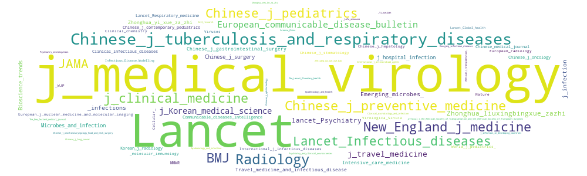

p style="text-align: center;">Quick links: [Notable papers(today)[./papers/topjpapers_today.md], Abstracts(today)[./papers/todayabstract.md], All papers[./papers/allpapers.md]

# Recent Coronavirus Paper Archive  코로나바이러스 연구 결과 모음 
  
*[English]*   Novel Coronavirus (also known as cov-2, nCoV, COVID-19) is sweeping over the world, also being a pressing issue in Korea. Reflecting the gravity of the serious illness, this repository will serve as a brief introduction to recent academic papers on the virus, possibly helping people more informed with what's been researched over the virus across the globe. This repository will be composed of a list of corona virus, organized by similarity and capitulated based on the significance of each paper. All explanations will be in both english and counterpart korean translation.

*[Korean]*   한국 내 코로나바이러스 (COVID-19)의 확진자 수가 지속적으로 증가함에 따라 본인을 포함한 많은 사람들의 불안이 상당하다 생각된다. 본 페이지에서는 COVID-19 바이러스의 최신 연구 논문을 최신 자료부터 차례로 공개하고, 시간이 허용하는 선에서 각 논문을 요약할 것이며, 동시에 본 작성자의 의견 또한 개진될 목적으로 운영될 계획이다. 바이러스가 잠잠해지길 기대함과 동시에 앞으로의 대한 두려움 또한 커지는 시기이다. 본 공간을 통해 작성자는 논문을 정리함으로써 바이러스에 대한 이해를 도모할 것이며, 이러한 과정에서 다른 시민들 또한 객관적인 자료들에 대한 접근성을 확보하고, 더불어 대처 과정에서 도움이 되기를 바라는 마음이다.     
 
 

**WordCloud 1: Paper keywords** Wordcloud above has been generated based on gross keywords (as provided by PubMed) of all collected papers. Larger words were seen more frequently as paper keywords.  통계 1: (논문 키워드) 위 그림은 확보한 논문들의 키워드들을 바탕으로 제작되었음.
  
  
 

**WordCloud 2: Published Journals** It has been generated based on gross publications of each journal related to COVID-19. Journals with larger words have published more papers.  
 통계 2: (저널 게재량) 위 그림은 각 저널의 코로나바이러스 관련 논문 게재량을 바탕으로 제작되었음.
 
 

## To-do List 논문 업로드 및 정리 계획

* [ ] Quick summary added for papers or groups of papers. 
      중요 논문 혹은 여러 논문에 대한 요약 및 그 시사성 정리
* [ ] Sort papers by date, nation and its nature. 
      날짜와 국가, 그리고 그 성격을 기준으로 한 논문의 정리
* [x] Upload newly published papers in a timely manner.  
      새로이 게재되는 논문의 실시간 반영
* [x] Paper list (past papers planned to be updated by 2/29/2020) 
      공개된 논문의 정리 (기존 논문은 2/29/2020까지 정리 예정)

 

## Significant result of the day 오늘의 추천 논문
- will be updated

## Read today's abstracts 오늘 게재된 논문의 초록 읽기
- [**Paper abstracts (published today)**](./papers/todayabstract.md)

## High impact journal papers 상위 랭크 저널 논문 리스트

- [**See high impact journal (IF>7) papers**](./papers/topjpapers.md)

## All Papers 전체 논문 리스트

- [**All papers link (전체 논문 링크)**](./papers/allpapers.md)

- Paper search has been done systematically, mostly within [PubMed](https://www.ncbi.nlm.nih.gov/pubmed/), with the keywords, 'nCoV', 'cov-2', 'coronavirus' or 'COVID-19'.  
  논문들은 대표적인 생물학 관련 논문 사이트인 [PubMed](https://www.ncbi.nlm.nih.gov/pubmed/)에서 'nCoV', 'cov-2', 'coronavirus' or 'COVID-19' 등의 키워드를 활용하여 수집되었음

